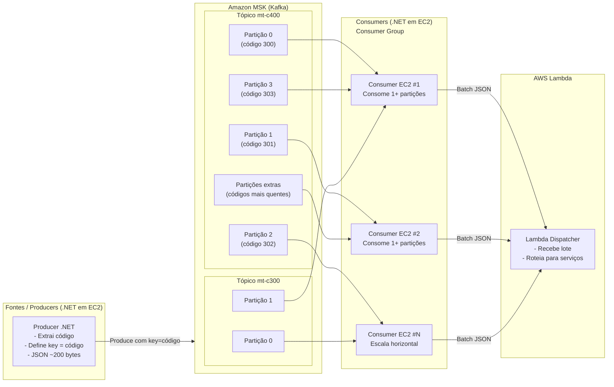
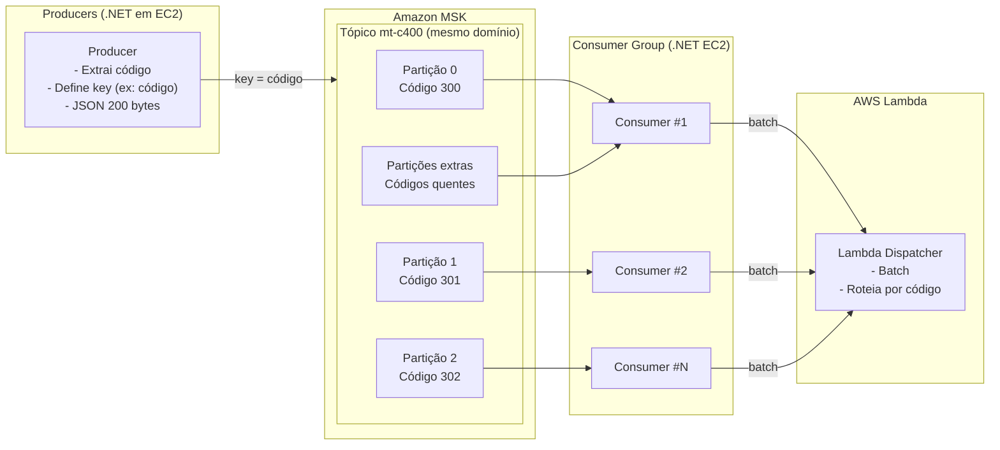
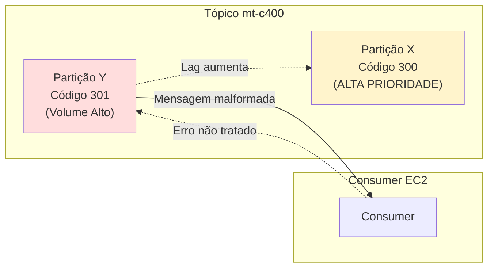
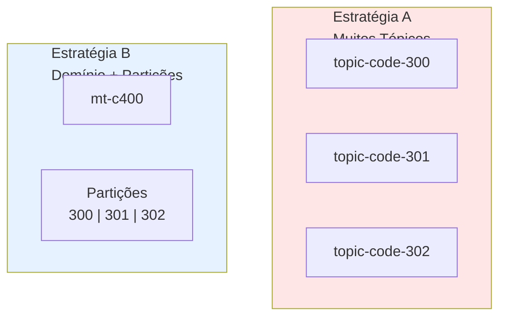
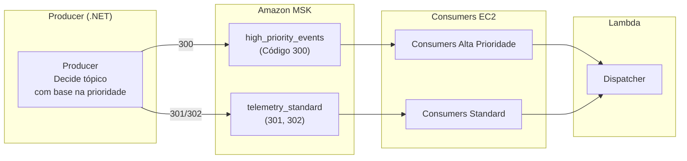
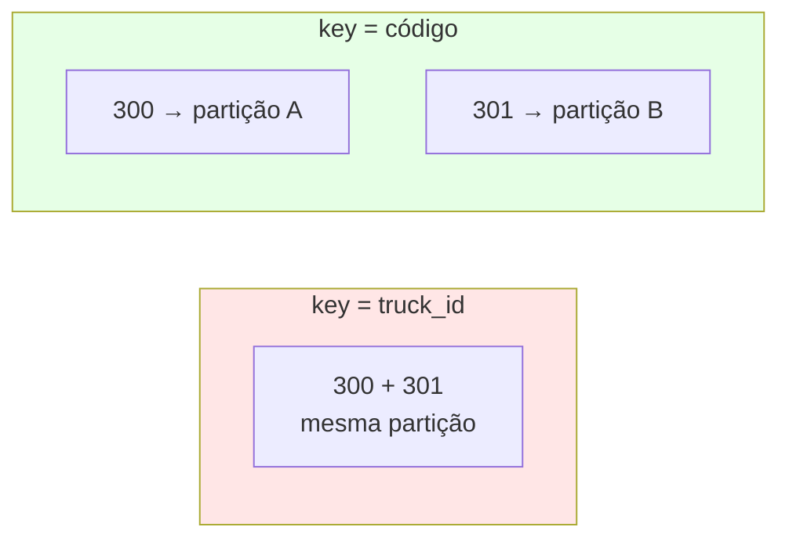
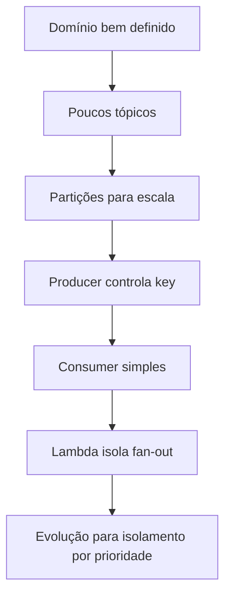

## Diagrama de Arquitetura – Fluxo End-to-End


### 1️⃣ Producer (.NET em EC2)

* O Producer **não cria partições dinamicamente**.
* Ele apenas:

  * Lê a mensagem
  * Extrai o `codigo`
  * Define `key = codigo`
* O Kafka garante que **a mesma key sempre vai para a mesma partição**.

👉 **Decisão importante**:
A lógica de distribuição está no **Producer**, não no MSK.

---

### 2️⃣ Tópicos Kafka (Domínio de Negócio)

* Cada tópico representa um **domínio funcional** (`mt-c400`, `mt-c300`).
* Não há um tópico por código → evita explosão de tópicos.
* O tópico mais pesado (`mt-c400`) possui **mais partições**.

👉 **Argumento forte**:

> “Tópicos representam domínios, partições representam escala.”

---

### 3️⃣ Partições (Escala e Paralelismo)

* Cada partição é:

  * Unidade de paralelismo
  * Unidade de ordenação
* Códigos mais frequentes podem:

  * Ter partições dedicadas
  * Ou múltiplas partições no futuro (sub-key)

👉 **Trade-off consciente**:
Possibilidade de hot partition, mitigável com monitoramento.

---

### 4️⃣ Consumers em EC2 (.NET)

* Consumers fazem parte de **um único consumer group**.
* Kafka distribui automaticamente as partições.
* Escalar = subir mais EC2s.
* Cada consumer:

  * Consome mensagens
  * Agrupa em lote
  * Confirma offset após sucesso

👉 **Benefício**:
Escala horizontal sem mudança de código.

---

### 5️⃣ Lambda (Fan-out e Distribuição)

* Recebe mensagens **em lote**.
* Reduz custo de invocação.
* Faz roteamento para serviços downstream.
* Mantém consumer simples e rápido.

👉 **Separação clara de responsabilidades**:

* Kafka = throughput
* EC2 = processamento contínuo
* Lambda = distribuição e elasticidade

---

## Mensagem-chave para convencer os pares

> “Essa arquitetura desloca a complexidade para onde temos controle (Producer e Consumer) e mantém o MSK simples, estável e escalável. Ela evita explosão de tópicos, permite crescimento previsível e é compatível com volumes industriais de mensagens.”

Ótimo ponto. Como você está desenhando **arquitetura de alto throughput com Kafka + MSK + .NET + Lambda**, existem **conceitos fundamentais (teóricos e práticos)** que valem muito a pena você dominar e até **defender tecnicamente** em reuniões, ADRs ou banca acadêmica. Vou organizar em **camadas conceituais**, sempre conectando com o seu cenário real (13k msg/s, Pareto 80/20, múltiplos tópicos e partições).

---

## 1. Conceitos fundamentais de Kafka que você DEVE abordar

### 1.1 Tópico ≠ Fila (log distribuído)

**Conceito**

* Kafka não é uma fila tradicional, é um **log distribuído e particionado**.
* Mensagens **não são removidas ao serem consumidas**.
* Cada consumidor mantém seu **offset**.

**Por que isso importa no seu caso**

* Você pode ter **vários consumidores lendo o mesmo tópico** (ex: analytics, auditoria, distribuição).
* O Lambda não “consome” a mensagem, ele **processa uma posição do log**.
* Reprocessamento é possível (reset de offset).

**Frase-chave para defender**

> “Kafka desacopla produtores e consumidores usando um log imutável, o que nos dá replay, escalabilidade e tolerância a falhas.”

---

### 1.2 Partições = unidade real de paralelismo

**Conceito**

* A **partição é a menor unidade de paralelismo** no Kafka.
* Uma partição → **1 consumidor por consumer group**.
* Não existe paralelismo dentro de uma partição.

**No seu cenário**

* Se você quer processar **13.000 msg/s**, precisa dividir isso em **fatias paralelas**.
* Exemplo:

  * 13.000 / 13 partições ≈ 1.000 msg/s por partição
  * 13 consumidores em paralelo

**Decisão arquitetural**

* `mt-c400` → muitas partições
* `mt-c300` → poucas partições

**Frase forte**

> “Escalar Kafka é escalar partições, não CPU.”

---

### 1.3 Consumer Group como mecanismo de balanceamento automático

**Conceito**

* Um **consumer group** garante:

  * Balanceamento automático de partições
  * Failover transparente
  * Escalabilidade horizontal

**No seu caso**

* Você sobe mais instâncias do serviço C#
* Kafka redistribui partições
* Nenhuma configuração manual

**Relação direta com Lambda**

* Event Source Mapping do Lambda cria **um consumer group gerenciado pela AWS**

**Frase**

> “Consumer groups nos dão elasticidade sem coordenação manual.”

---

## 2. Conceitos de particionamento (onde está o ouro)

### 2.1 Hash vs Key-based partitioning

#### Hash / Round-robin

* Máximo throughput
* Carga bem distribuída
* Ordem global NÃO garantida

#### Key-based (ex: código 300, 301…)

* Ordem garantida por chave
* Possível hotspot

**No seu cenário**

* 80% das mensagens vêm de poucos códigos
* Se particionar só pelo código → risco de gargalo

**Decisão madura**

* Usar **composite key**:

  ```text
  key = codigo + hash(deviceId)
  ```

**Frase técnica**

> “Mantemos ordem lógica sem sacrificar paralelismo físico.”

---

### 2.2 Hot partitions e Lei de Pareto (80/20)

**Conceito**

* 20% das chaves geram 80% do tráfego
* Kafka não resolve hotspot sozinho

**Soluções arquiteturais**

1. Mais partições no tópico quente
2. Tópico dedicado para heavy hitters
3. Sub-particionamento lógico
4. Sharding por tempo ou região

**Exemplo**

* `mt-c400-heavy`
* `mt-c400-light`

**Frase**

> “Identificamos hot keys e tratamos como first-class citizens da arquitetura.”

---

## 3. Conceitos de throughput e performance

### 3.1 Batching (o conceito mais subestimado)

**Conceito**

* Kafka é otimizado para **lotes**, não mensagens individuais
* Produzir e consumir em batch aumenta throughput em ordens de magnitude

**No consumidor C#**

* `max.poll.records`
* Processar arrays
* Enviar batches ao Lambda

**Frase**

> “Nós otimizamos chamadas, não mensagens.”

---

### 3.2 Backpressure (fundamental para estabilidade)

**Conceito**

* O sistema **precisa saber desacelerar**
* Sem isso → colapso em cascata

**No seu pipeline**

```
Kafka → C# → Lambda → Serviços
```

**Estratégias**

* Pausar consumo (`Pause/Resume`)
* Controlar batch size
* Limitar concorrência do Lambda
* DLQ para falhas

**Frase**

> “Preferimos atrasar processamento a perder dados.”

---

## 4. Conceitos de semântica de entrega

### 4.1 At-least-once vs At-most-once vs Exactly-once

**Kafka por padrão**

* At-least-once

**O que isso significa**

* Mensagens podem ser reprocessadas
* Seu downstream precisa ser **idempotente**

**No Lambda**

* Use:

  * Deduplicação
  * Chave de idempotência
  * DynamoDB conditional writes

**Frase**

> “Garantimos consistência por design, não por sorte.”

---

## 5. Kafka + Lambda: choque de modelos

### 5.1 Pull (Kafka) vs Push (Lambda)

**Kafka**

* Pull-based
* Controle de ritmo no consumidor

**Lambda**

* Push-based
* Escala agressivamente

**Conflito**

* Lambda pode escalar mais rápido que downstream

**Solução**

* Batch controlado
* Concurrency limit
* Step Functions ou SQS buffer se necessário

**Frase**

> “Integramos dois modelos opostos controlando o ponto de acoplamento.”

---

## 6. Conceitos de observabilidade (nível sênior)

### 6.1 Lag como SLO

**Conceito**

* Lag = backlog real
* Métrica mais importante do Kafka

**Você deve monitorar**

* Lag por partição
* Throughput por consumer
* Tempo Kafka → Lambda

**Frase**

> “Lag é nosso termômetro operacional.”

---

### 6.2 Tracing distribuído

**Conceito**

* Uma mensagem cruza:

  * Kafka
  * C#
  * Lambda
  * Serviços

**Solução**

* Correlation ID
* OpenTelemetry
* Logs estruturados

**Frase**

> “Observabilidade não é opcional em sistemas distribuídos.”

---

## 7. Conceitos de arquitetura (para fechar com chave de ouro)

### 7.1 Desacoplamento por eventos

**Você está construindo**

* Uma **arquitetura orientada a eventos**
* Não RPC, não request/response

**Benefícios**

* Escalabilidade
* Evolução independente
* Resiliência

---

### 7.2 Design para falha

**Assumir**

* Broker cai
* Consumer cai
* Lambda falha

**Kafka permite**

* Replay
* Retenção
* Reprocessamento controlado

**Frase final forte**

> “Não evitamos falhas, projetamos para sobreviver a elas.”

---

## Se quiser ir além (nível doutorado / staff engineer)

Posso te ajudar a:

* Criar **ADR formal** dessas decisões
* Calcular **número ótimo de partições**
* Simular throughput em Python
* Criar um **diagrama C4**
* Escrever isso como **capítulo de tese ou whitepaper**

Perfeito. Abaixo está um **diagrama em Mermaid** focado **exatamente nos pontos de tensão da discussão arquitetural**:
isolamento vs compartilhamento, blast radius, prioridade, chave de partição e evolução para arquitetura híbrida.

A ideia não é só mostrar o “fluxo feliz”, mas **visualizar os riscos e as decisões**.

---

## 1️⃣ Visão Geral – Arquitetura Atual (Domínio + Partições)



### 🧠 O que este diagrama explica

* **Partições são a unidade de escala**, não tópicos
* Ordem é garantida **por código**, não global
* Consumer é genérico → reduz filtering cost
* Lambda isola lógica e fan-out

---

## 2️⃣ Onde mora o risco – Blast Radius e Hot Partition



### ⚠️ O que este diagrama evidencia

* Um erro em dados **não críticos** pode:

  * Aumentar lag
  * Afetar processamento crítico
* Esse risco **só existe** se:

  * Consumer tiver lógica pesada
  * Erro travar partição

👉 **Mitigação**:

* Consumer simples
* DLQ
* Try/catch por mensagem

---

## 3️⃣ Comparação visual – Muitos Tópicos vs Poucos Tópicos



### 📊 Leitura arquitetural

* Estratégia A:

  * Alto isolamento
  * Alto custo operacional
  * Topic sprawl
* Estratégia B:

  * Bom isolamento lógico
  * Escala eficiente
  * Governança centralizada

---

## 4️⃣ Evolução Natural – Arquitetura Híbrida (Prioridade)



### 🧠 Mensagem-chave

* Evolução **não quebra o desenho atual**
* Producer já controla:

  * Key
  * Tópico
* Isolamento cresce conforme criticidade

---

## 5️⃣ Decisão sobre chave – `truck_id` vs `codigo`



### 📌 Interpretação

* `truck_id`:

  * Ordem forte
  * Alto acoplamento
* `codigo`:

  * Melhor isolamento
  * Ordem suficiente
  * Menor blast radius

---

## 6️⃣ Diagrama mental para defender a arquitetura



---

## 🎯 Como usar esse material na discussão

Você pode literalmente apontar para os diagramas e dizer:

* “Aqui está onde assumimos risco conscientemente”
* “Aqui está como mitigamos”
* “Aqui está como evoluímos sem reescrever tudo”

Se quiser, no próximo passo posso:

* Converter isso em **slides**
* Gerar uma **documentação Markdown**
* Criar um **ADR formal com esses diagramas**

Esse nível de discussão mostra **arquitetura madura, não dogmática**.

