## Diagrama de Arquitetura – Fluxo End-to-End

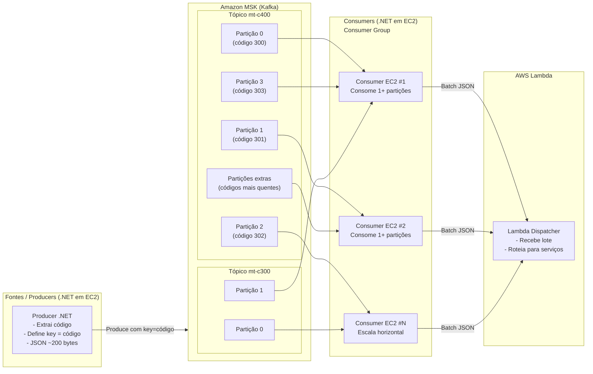
### 1️⃣ Producer (.NET em EC2)

* O Producer **não cria partições dinamicamente**.
* Ele apenas:

  * Lê a mensagem
  * Extrai o `codigo`
  * Define `key = codigo`
* O Kafka garante que **a mesma key sempre vai para a mesma partição**.

👉 **Decisão importante**:
A lógica de distribuição está no **Producer**, não no MSK.

---

### 2️⃣ Tópicos Kafka (Domínio de Negócio)

* Cada tópico representa um **domínio funcional** (`mt-c400`, `mt-c300`).
* Não há um tópico por código → evita explosão de tópicos.
* O tópico mais pesado (`mt-c400`) possui **mais partições**.

👉 **Argumento forte**:

> “Tópicos representam domínios, partições representam escala.”

---

### 3️⃣ Partições (Escala e Paralelismo)

* Cada partição é:

  * Unidade de paralelismo
  * Unidade de ordenação
* Códigos mais frequentes podem:

  * Ter partições dedicadas
  * Ou múltiplas partições no futuro (sub-key)

👉 **Trade-off consciente**:
Possibilidade de hot partition, mitigável com monitoramento.

---

### 4️⃣ Consumers em EC2 (.NET)

* Consumers fazem parte de **um único consumer group**.
* Kafka distribui automaticamente as partições.
* Escalar = subir mais EC2s.
* Cada consumer:

  * Consome mensagens
  * Agrupa em lote
  * Confirma offset após sucesso

👉 **Benefício**:
Escala horizontal sem mudança de código.

---

### 5️⃣ Lambda (Fan-out e Distribuição)

* Recebe mensagens **em lote**.
* Reduz custo de invocação.
* Faz roteamento para serviços downstream.
* Mantém consumer simples e rápido.

👉 **Separação clara de responsabilidades**:

* Kafka = throughput
* EC2 = processamento contínuo
* Lambda = distribuição e elasticidade

---

## Mensagem-chave para convencer os pares

> “Essa arquitetura desloca a complexidade para onde temos controle (Producer e Consumer) e mantém o MSK simples, estável e escalável. Ela evita explosão de tópicos, permite crescimento previsível e é compatível com volumes industriais de mensagens.”

Ótimo ponto. Como você está desenhando **arquitetura de alto throughput com Kafka + MSK + .NET + Lambda**, existem **conceitos fundamentais (teóricos e práticos)** que valem muito a pena você dominar e até **defender tecnicamente** em reuniões, ADRs ou banca acadêmica. Vou organizar em **camadas conceituais**, sempre conectando com o seu cenário real (13k msg/s, Pareto 80/20, múltiplos tópicos e partições).

---

## 1. Conceitos fundamentais de Kafka que você DEVE abordar

### 1.1 Tópico ≠ Fila (log distribuído)

**Conceito**

* Kafka não é uma fila tradicional, é um **log distribuído e particionado**.
* Mensagens **não são removidas ao serem consumidas**.
* Cada consumidor mantém seu **offset**.

**Por que isso importa no seu caso**

* Você pode ter **vários consumidores lendo o mesmo tópico** (ex: analytics, auditoria, distribuição).
* O Lambda não “consome” a mensagem, ele **processa uma posição do log**.
* Reprocessamento é possível (reset de offset).

**Frase-chave para defender**

> “Kafka desacopla produtores e consumidores usando um log imutável, o que nos dá replay, escalabilidade e tolerância a falhas.”

---

### 1.2 Partições = unidade real de paralelismo

**Conceito**

* A **partição é a menor unidade de paralelismo** no Kafka.
* Uma partição → **1 consumidor por consumer group**.
* Não existe paralelismo dentro de uma partição.

**No seu cenário**

* Se você quer processar **13.000 msg/s**, precisa dividir isso em **fatias paralelas**.
* Exemplo:

  * 13.000 / 13 partições ≈ 1.000 msg/s por partição
  * 13 consumidores em paralelo

**Decisão arquitetural**

* `mt-c400` → muitas partições
* `mt-c300` → poucas partições

**Frase forte**

> “Escalar Kafka é escalar partições, não CPU.”

---

### 1.3 Consumer Group como mecanismo de balanceamento automático

**Conceito**

* Um **consumer group** garante:

  * Balanceamento automático de partições
  * Failover transparente
  * Escalabilidade horizontal

**No seu caso**

* Você sobe mais instâncias do serviço C#
* Kafka redistribui partições
* Nenhuma configuração manual

**Relação direta com Lambda**

* Event Source Mapping do Lambda cria **um consumer group gerenciado pela AWS**

**Frase**

> “Consumer groups nos dão elasticidade sem coordenação manual.”

---

## 2. Conceitos de particionamento (onde está o ouro)

### 2.1 Hash vs Key-based partitioning

#### Hash / Round-robin

* Máximo throughput
* Carga bem distribuída
* Ordem global NÃO garantida

#### Key-based (ex: código 300, 301…)

* Ordem garantida por chave
* Possível hotspot

**No seu cenário**

* 80% das mensagens vêm de poucos códigos
* Se particionar só pelo código → risco de gargalo

**Decisão madura**

* Usar **composite key**:

  ```text
  key = codigo + hash(deviceId)
  ```

**Frase técnica**

> “Mantemos ordem lógica sem sacrificar paralelismo físico.”

---

### 2.2 Hot partitions e Lei de Pareto (80/20)

**Conceito**

* 20% das chaves geram 80% do tráfego
* Kafka não resolve hotspot sozinho

**Soluções arquiteturais**

1. Mais partições no tópico quente
2. Tópico dedicado para heavy hitters
3. Sub-particionamento lógico
4. Sharding por tempo ou região

**Exemplo**

* `mt-c400-heavy`
* `mt-c400-light`

**Frase**

> “Identificamos hot keys e tratamos como first-class citizens da arquitetura.”

---

## 3. Conceitos de throughput e performance

### 3.1 Batching (o conceito mais subestimado)

**Conceito**

* Kafka é otimizado para **lotes**, não mensagens individuais
* Produzir e consumir em batch aumenta throughput em ordens de magnitude

**No consumidor C#**

* `max.poll.records`
* Processar arrays
* Enviar batches ao Lambda

**Frase**

> “Nós otimizamos chamadas, não mensagens.”

---

### 3.2 Backpressure (fundamental para estabilidade)

**Conceito**

* O sistema **precisa saber desacelerar**
* Sem isso → colapso em cascata

**No seu pipeline**

```
Kafka → C# → Lambda → Serviços
```

**Estratégias**

* Pausar consumo (`Pause/Resume`)
* Controlar batch size
* Limitar concorrência do Lambda
* DLQ para falhas

**Frase**

> “Preferimos atrasar processamento a perder dados.”

---

## 4. Conceitos de semântica de entrega

### 4.1 At-least-once vs At-most-once vs Exactly-once

**Kafka por padrão**

* At-least-once

**O que isso significa**

* Mensagens podem ser reprocessadas
* Seu downstream precisa ser **idempotente**

**No Lambda**

* Use:

  * Deduplicação
  * Chave de idempotência
  * DynamoDB conditional writes

**Frase**

> “Garantimos consistência por design, não por sorte.”

---

## 5. Kafka + Lambda: choque de modelos

### 5.1 Pull (Kafka) vs Push (Lambda)

**Kafka**

* Pull-based
* Controle de ritmo no consumidor

**Lambda**

* Push-based
* Escala agressivamente

**Conflito**

* Lambda pode escalar mais rápido que downstream

**Solução**

* Batch controlado
* Concurrency limit
* Step Functions ou SQS buffer se necessário

**Frase**

> “Integramos dois modelos opostos controlando o ponto de acoplamento.”

---

## 6. Conceitos de observabilidade (nível sênior)

### 6.1 Lag como SLO

**Conceito**

* Lag = backlog real
* Métrica mais importante do Kafka

**Você deve monitorar**

* Lag por partição
* Throughput por consumer
* Tempo Kafka → Lambda

**Frase**

> “Lag é nosso termômetro operacional.”

---

### 6.2 Tracing distribuído

**Conceito**

* Uma mensagem cruza:

  * Kafka
  * C#
  * Lambda
  * Serviços

**Solução**

* Correlation ID
* OpenTelemetry
* Logs estruturados

**Frase**

> “Observabilidade não é opcional em sistemas distribuídos.”

---

## 7. Conceitos de arquitetura (para fechar com chave de ouro)

### 7.1 Desacoplamento por eventos

**Você está construindo**

* Uma **arquitetura orientada a eventos**
* Não RPC, não request/response

**Benefícios**

* Escalabilidade
* Evolução independente
* Resiliência

---

### 7.2 Design para falha

**Assumir**

* Broker cai
* Consumer cai
* Lambda falha

**Kafka permite**

* Replay
* Retenção
* Reprocessamento controlado

**Frase final forte**

> “Não evitamos falhas, projetamos para sobreviver a elas.”

---

## Se quiser ir além (nível doutorado / staff engineer)

Posso te ajudar a:

* Criar **ADR formal** dessas decisões
* Calcular **número ótimo de partições**
* Simular throughput em Python
* Criar um **diagrama C4**
* Escrever isso como **capítulo de tese ou whitepaper**

Perfeito. Abaixo está um **diagrama em Mermaid** focado **exatamente nos pontos de tensão da discussão arquitetural**:
isolamento vs compartilhamento, blast radius, prioridade, chave de partição e evolução para arquitetura híbrida.

A ideia não é só mostrar o “fluxo feliz”, mas **visualizar os riscos e as decisões**.

---

## 1️⃣ Visão Geral – Arquitetura Atual (Domínio + Partições)

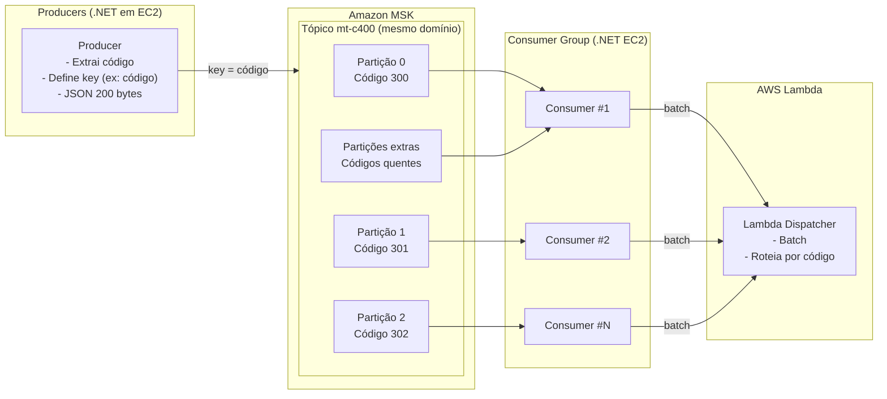

### 🧠 O que este diagrama explica

* **Partições são a unidade de escala**, não tópicos
* Ordem é garantida **por código**, não global
* Consumer é genérico → reduz filtering cost
* Lambda isola lógica e fan-out

---

## 2️⃣ Onde mora o risco – Blast Radius e Hot Partition

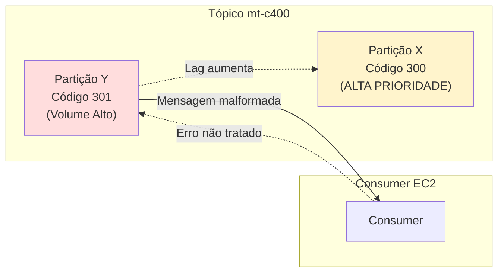

### ⚠️ O que este diagrama evidencia

* Um erro em dados **não críticos** pode:

  * Aumentar lag
  * Afetar processamento crítico
* Esse risco **só existe** se:

  * Consumer tiver lógica pesada
  * Erro travar partição

👉 **Mitigação**:

* Consumer simples
* DLQ
* Try/catch por mensagem

---

## 3️⃣ Comparação visual – Muitos Tópicos vs Poucos Tópicos

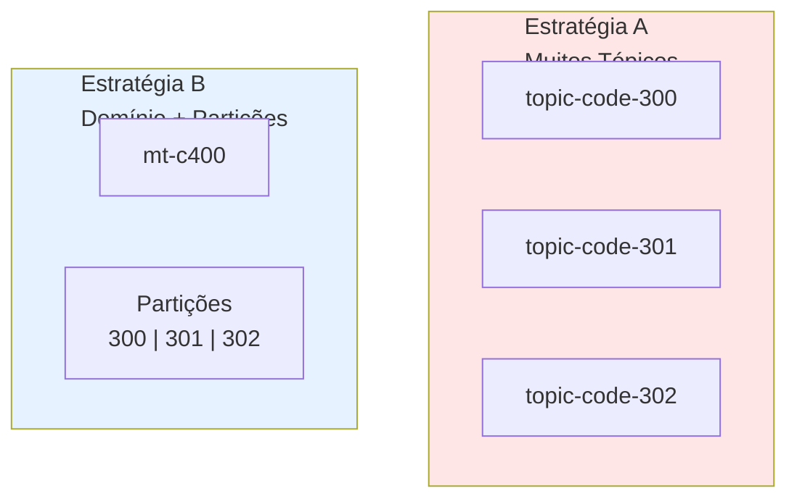

### 📊 Leitura arquitetural

* Estratégia A:

  * Alto isolamento
  * Alto custo operacional
  * Topic sprawl
* Estratégia B:

  * Bom isolamento lógico
  * Escala eficiente
  * Governança centralizada

---

## 4️⃣ Evolução Natural – Arquitetura Híbrida (Prioridade)

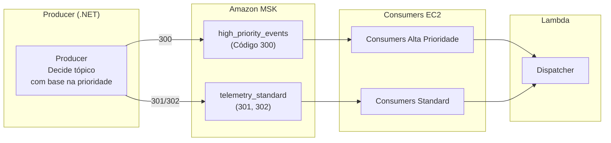

### 🧠 Mensagem-chave

* Evolução **não quebra o desenho atual**
* Producer já controla:

  * Key
  * Tópico
* Isolamento cresce conforme criticidade

---

## 5️⃣ Decisão sobre chave – `truck_id` vs `codigo`

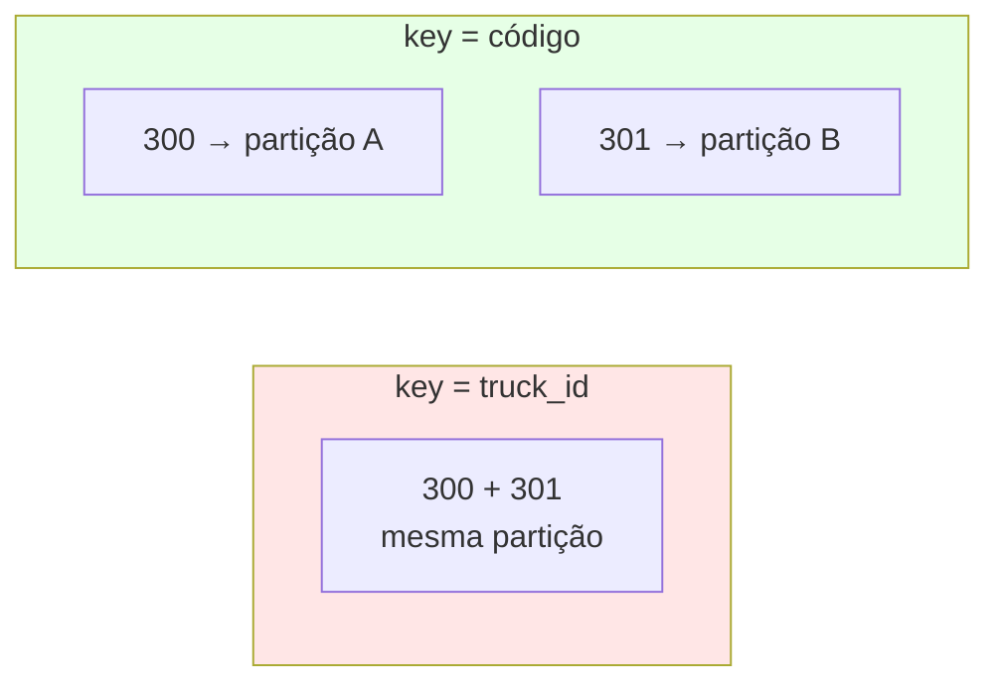

### 📌 Interpretação

* `truck_id`:

  * Ordem forte
  * Alto acoplamento
* `codigo`:

  * Melhor isolamento
  * Ordem suficiente
  * Menor blast radius

---

## 6️⃣ Diagrama mental para defender a arquitetura

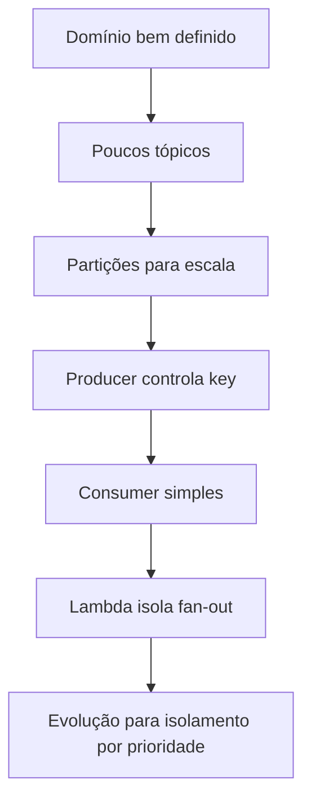

---

## 🎯 Como usar esse material na discussão

Você pode literalmente apontar para os diagramas e dizer:

* “Aqui está onde assumimos risco conscientemente”
* “Aqui está como mitigamos”
* “Aqui está como evoluímos sem reescrever tudo”


*** 

# Abordagem do producer 

1. Objetivo da POC
2. Responsabilidades do Producer
3. Arquitetura lógica do Producer
4. Estratégia para tópicos e partições
5. Escala: 1 instância vs múltiplas instâncias
6. Controle, observabilidade e governança
7. Fluxograma (Mermaid)
8. Etapas de implementação
9. Pontos perigosos e riscos reais

---

# 🎯 1. Objetivo da POC (Producer)

### O que a POC PRECISA provar

A POC do **Producer EC2 .NET** deve responder objetivamente:

* Consigo **publicar corretamente** em múltiplos tópicos?
* Consigo **controlar a distribuição de mensagens por partição**?
* Consigo **simular volume realista**?
* Consigo **escalar horizontalmente sem quebrar nada**?
* Consigo **medir impacto em latência e custo**?

⚠️ **Importante**:
A POC **não** precisa:

* Ser altamente resiliente
* Ter autoscaling perfeito
* Ter HA completo

Ela precisa **validar decisões arquiteturais**, não ser produção.

---

# 🧱 2. Responsabilidades do Producer

O Producer **não é burro**, mas também **não deve ser inteligente demais**.

### Responsabilidades corretas

✔ Escolher o tópico
✔ Definir a key de partição
✔ Garantir confiabilidade (`acks=all`)
✔ Controlar taxa (throttling)
✔ Emitir métricas

### Responsabilidades que NÃO são dele

❌ Saber quantas partições existem
❌ Fazer load balancing manual
❌ Garantir ordem global
❌ Saber quem vai consumir

👉 **Kafka já faz isso melhor.**

---

# 🧠 3. Arquitetura lógica do Producer

Pense no Producer como **pipeline**, não como um “serviço REST”.

```
Input Generator
     ↓
Message Builder
     ↓
Topic Resolver
     ↓
Partition Key Resolver
     ↓
Kafka Producer
     ↓
Metrics & Logs
```

---

# 🧩 4. Estratégia para tópicos e partições

## 🔑 Regra de ouro

> **Producer escolhe a KEY, Kafka escolhe a PARTIÇÃO**

### Exemplo

```text
Topic: mt-c400
Key: hash(codigo + truck_id)
```

Kafka:

* Aplica hash(key)
* Mod N (partições)
* Distribui automaticamente

⚠️ Você **não** deve usar `partition=X` manualmente na POC.

---

## 🔍 Estratégia de chave (decisão crítica)

### Opções

| Estratégia           | Prós               | Contras        |
| -------------------- | ------------------ | -------------- |
| `truck_id`           | Ordem por caminhão | Hot partitions |
| `codigo`             | Isolamento lógico  | Perda de ordem |
| `hash(codigo+truck)` | Equilíbrio         | Ordem parcial  |

👉 **Para POC:**
Use `hash(codigo + truck_id)`
É a mais defensável.

---

# ⚖️ 5. Escala: quantas instâncias de Producer?

### ❗ Verdade importante

> **Kafka Producer escala melhor por THREAD do que por INSTÂNCIA**

### Estratégia correta para POC

#### Fase 1 – 1 EC2

* 1 processo
* 1 Producer
* 5–10 threads
* Controle de TPS

#### Fase 2 – 2 EC2

* Mesma config
* Mesmos tópicos
* Mesmas chaves

👉 Kafka garante que:

* Não há duplicação
* Não há conflito
* Não há desordem por key

---

## ⚠️ Erro comum

> “Vou criar um Producer por partição”

❌ ERRADO
Isso quebra:

* Escala
* Rebalance
* Custo

---

# 🎛️ 6. Controle e governança

### Controle de taxa (obrigatório)

```text
- Mensagens/segundo
- Bytes/segundo
```

Implemente:

* Token bucket simples
* Sleep controlado
* Config via ENV VAR

---

### Observabilidade mínima

| Métrica     | Por quê        |
| ----------- | -------------- |
| msg/s       | Throughput     |
| ack latency | Saúde MSK      |
| error rate  | Confiabilidade |
| retries     | Saturação      |

---

# 🔁 7. Fluxograma do Producer (Mermaid)

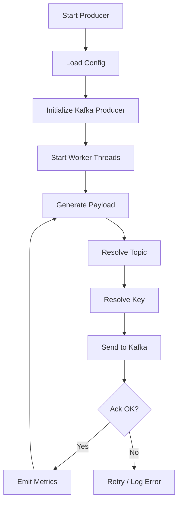

---

# 🛠️ 8. Etapas práticas da POC

## Etapa 1 – Infra mínima

* EC2 t3.medium
* Security Group liberando MSK
* Certificados funcionando

---

## Etapa 2 – Código Producer .NET

Componentes:

* `ProducerFactory`
* `MessageGenerator`
* `TopicRouter`
* `KeyResolver`
* `MetricsEmitter`

---

## Etapa 3 – Simulação de carga

* Ramp-up gradual
* 1 → 5 → 10 threads
* Observa latência

---

## Etapa 4 – Scale-out

* Sobe segunda EC2
* Mesmo código
* Observa:

  * Distribuição
  * Throughput
  * Impacto no MSK

---

# ☠️ 9. Pontos perigosos e riscos reais

## 🔥 Risco 1 – Hot partitions

* Chave mal escolhida
* Solução: hash composta

---

## 🔥 Risco 2 – Buffer interno do Producer

* `queue.buffering.max.messages`
* Pode causar OOM
* Monitorar

---

## 🔥 Risco 3 – Backpressure invisível

* MSK lento
* Producer continua aceitando
* Latência explode

---

## 🔥 Risco 4 – Overengineering

* Producer “inteligente demais”
* Lógica duplicada
* Difícil de manter

---

## 🔥 Risco 5 – Falta de métricas

> “Sem métricas, você não tem arquitetura, só esperança.”

---

# 🧠 Conclusão arquitetural

> O Producer **não controla o Kafka**.
> Ele **declara intenção** (key, tópico, confiabilidade).
> O Kafka **executa a estratégia de escala**.

Essa POC vai te permitir:

* Defender a arquitetura com números
* Antecipar gargalos
* Calibrar decisões antes da produção

---

## 🔜 Próximo passo (se quiser)

Posso:

* Criar **pseudocódigo .NET detalhado do Producer**
* Criar **checklist de POC**
* Criar **template de relatório de resultados**
* Avançar para **EC2 Consumer**

Se quiser, diga:
👉 *“Vamos detalhar o código do Producer”*

Perfeito. Vou te entregar **dois diagramas complementares**, no nível que normalmente aparece em **documentação de arquitetura séria**:

1. **Diagrama arquitetural do Producer (visão estrutural)**
2. **Fluxograma detalhado de execução do Producer (visão comportamental)**

Ambos pensados para:

* Sustentar discussão com arquitetos, SRE e FinOps
* Ajudar alguém a **construir o serviço do zero**
* Deixar explícito **onde estão os riscos e controles**

---

# 🧱 1️⃣ Diagrama Arquitetural do Serviço Producer (.NET em EC2)

👉 **Pergunta que esse diagrama responde**

> “Que componentes existem dentro do Producer e como eles se relacionam?”

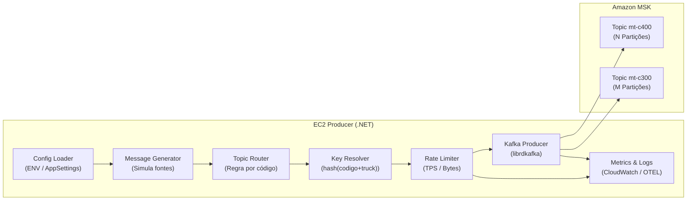

---

## 📌 Como explicar esse diagrama em reunião

* **Config Loader**
  → Nada hardcoded. TPS, tópicos e comportamento são configuráveis.

* **Message Generator**
  → Simula múltiplas fontes e Pareto (80/20).

* **Topic Router**
  → Decide *qual domínio* (mt-c400, mt-c300).

* **Key Resolver**
  → Define *como Kafka irá distribuir*.

* **Rate Limiter**
  → Protege o MSK **e o próprio Producer**.

* **Kafka Producer**
  → Único ponto de comunicação com o cluster.

* **Metrics**
  → Sem isso, a POC não vale nada.

---

# 🔁 2️⃣ Fluxograma Detalhado do Producer (Execução passo a passo)

👉 **Pergunta que esse fluxograma responde**

> “O que acontece exatamente desde o start até o envio contínuo?”

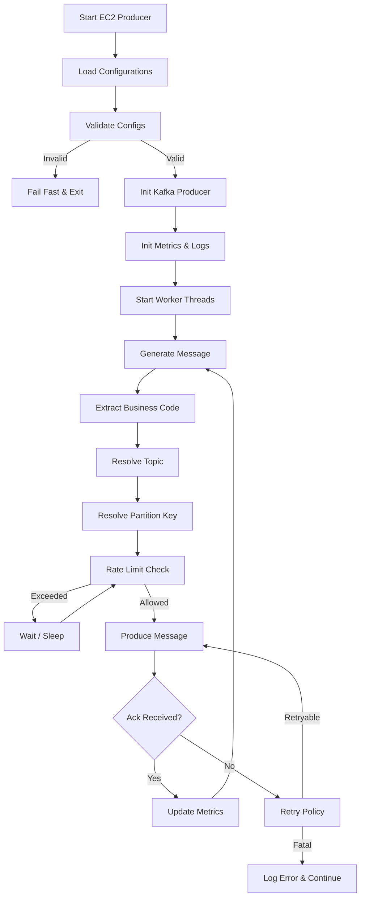

---

## 📌 Pontos críticos destacados no fluxograma

### 🔴 Fail Fast

* Se config errada → **não sobe**
* Evita producer “zumbi”

---

### 🔴 Rate Limiter antes do Kafka

* Kafka **não protege você**
* Sem isso:

  * Memória cresce
  * Latência explode
  * EC2 morre

---

### 🔴 Retry consciente

* Nem todo erro é retryável
* Erro de schema ≠ erro de rede

---

# ⚠️ Pontos perigosos explícitos no diagrama

| Ponto             | Risco              | Mitigação         |
| ----------------- | ------------------ | ----------------- |
| Key mal escolhida | Hot partition      | Hash composta     |
| Sem rate limit    | OOM                | Throttling        |
| Retries infinitos | Loop infinito      | Retry com limite  |
| Config fixa       | Impossível escalar | ENV vars          |
| Métricas pobres   | Arquitetura “cega” | CloudWatch / OTEL |

---

# 🧠 Como um arquiteto sênior justificaria esse desenho

> “Esse Producer não sabe nada sobre o MSK além do necessário. Ele declara intenção (tópico, chave, confiabilidade) e deixa o Kafka fazer o trabalho pesado. Isso reduz acoplamento, facilita escala e torna o comportamento previsível sob carga.”

---

# 📋 Checklist rápido (para POC)

✔ Código configurável
✔ Simulação Pareto
✔ Métricas claras
✔ Rate limit ativo
✔ Chave bem definida
✔ Fácil de escalar horizontalmente

Perfeito. Abaixo está um **PLAYBOOK DE AUMENTO DE PARTIÇÕES KAFKA (MSK)**, escrito no nível que **SRE, arquiteto e time .NET** esperam ver.
Ele cobre **quando fazer**, **impactos reais**, **o que esperar**, **como mitigar**, e **como o código .NET deve se comportar antes e depois**.

Este material é **diretamente reutilizável** na sua documentação oficial.

---

# 📘 PLAYBOOK – Aumento de Partições em Kafka (MSK)

## 🎯 Objetivo

Permitir **aumento de throughput e paralelismo** sem downtime, mantendo:

* previsibilidade operacional
* impacto controlado
* zero mudança no código do Producer/Consumer (.NET)

---

## 1️⃣ Quando aumentar partições (critérios objetivos)

Você **NÃO aumenta partições por intuição**.
Você aumenta quando **métricas indicam gargalo estrutural**.

### Indicadores claros

| Métrica                            | Sintoma                 |
| ---------------------------------- | ----------------------- |
| Consumer Lag cresce continuamente  | Capacidade insuficiente |
| Apenas algumas partições saturadas | Hot partition           |
| CPU de consumers < 50%             | Falta paralelismo       |
| Throughput estagnado               | Limite físico           |
| Escalar consumers não ajuda        | Falta partições         |

👉 **Regra prática**

> Número de partições ≥ número máximo esperado de consumers ativos

---

## 2️⃣ O que acontece tecnicamente ao aumentar partições

### Estado ANTES

```
Topic mt-c400
Partições: 8
partition = hash(key) % 8
```

### Estado DEPOIS

```
Topic mt-c400
Partições: 16
partition = hash(key) % 16
```

### Efeitos imediatos

✔ Mensagens antigas permanecem onde estão
✔ Mensagens novas passam a usar novas partições
⚠ A mesma key pode ir para outra partição
⚠ Ordem histórica entre mensagens antigas e novas é quebrada

👉 **Nada é perdido. Nada é duplicado.**

---

## 3️⃣ Impactos esperados (e normais)

### 3.1 Rebalance do Consumer Group

**O que acontece**

* Todos os consumers pausam
* Kafka redistribui partições
* Consumo retoma

**O que esperar**

* Pausa de segundos (ou minutos se exagerou nas partições)
* Lag temporário

**Mitigação**

* Aumentar partições fora do horário de pico
* Garantir que consumers sejam idempotentes

---

### 3.2 Redistribuição de carga

**Antes**

```
Partição 2 → 80% do tráfego
```

**Depois**

```
Partição 2 → 40%
Partição 10 → 40%
```

👉 **Esse é o ganho esperado.**

---

### 3.3 Mudança invisível para o Producer

✔ Producer não sabe
✔ Producer não muda
✔ Producer continua saudável

**SE** você usou:

* key-based partitioning
* sem partição fixa no código

---

## 4️⃣ Riscos reais e como resolver

### 🔥 RISCO 1 – Explosão de rebalance

**Causa**

* Muitas partições
* Muitos consumers
* Deploy frequente

**Mitigação**

* Evitar “partições demais”
* Preferir scale-up antes de scale-out
* Evitar restart em massa

---

### 🔥 RISCO 2 – Quebra de expectativa de ordem

**Causa**

* Key vai para outra partição

**Mitigação**

* Documentar claramente:

  > “Ordem é garantida apenas após o resize”
* Usar timestamp de evento

---

### 🔥 RISCO 3 – Hot partition continua

**Causa**

* Chave mal escolhida

**Mitigação**

```text
ANTES: key = codigo
DEPOIS: key = hash(codigo + truck_id)
```

---

## 5️⃣ Como se preparar ANTES do aumento (obrigatório)

### ✔ 1. Código .NET deve ser agnóstico a partições

❌ ERRADO

```csharp
new TopicPartition("mt-c400", new Partition(3))
```

✔ CORRETO

```csharp
producer.Produce(
    "mt-c400",
    new Message<string, string>
    {
        Key = $"{codigo}:{truckId}",
        Value = payload
    }
);
```

---

### ✔ 2. Consumers devem ser idempotentes

Após rebalance:

* Mensagem pode ser reprocessada
* Offset pode ser replayado

👉 Lambda downstream deve suportar isso.

---

### ✔ 3. Métricas obrigatórias antes do resize

* Consumer lag por partição
* Rebalance time
* Throughput por key
* Ack latency do Producer

---

## 6️⃣ Passo a passo operacional (Playbook)

### 🔹 PASSO 1 – Validar necessidade

* Confirmar gargalo
* Confirmar que mais consumers não resolvem

---

### 🔹 PASSO 2 – Escolher novo número

Regra prática:

```
Novo N = 2x partições atuais
```

Evite:

* Incrementos pequenos
* Ajustes frequentes

---

### 🔹 PASSO 3 – Executar resize

```bash
kafka-topics.sh \
  --bootstrap-server <broker> \
  --alter \
  --topic mt-c400 \
  --partitions 16
```

✔ Sem downtime
✔ Sem restart

---

### 🔹 PASSO 4 – Monitorar rebalance

Acompanhar:

* consumer-group-state
* lag total
* throughput

---

### 🔹 PASSO 5 – Validar estabilização

Critério de sucesso:

* Lag volta ao normal
* CPU de consumers sobe
* Throughput aumenta

---

## 7️⃣ O que NÃO fazer (anti-patterns)

❌ Fixar partições no Producer
❌ Criar lógica “partição dedicada” no código
❌ Aumentar partições toda semana
❌ Ignorar rebalance
❌ Achar que aumento é “sem impacto”

---

## 8️⃣ Pergunta dura de SRE (simulação)

### ❓ “Se dobrarmos as partições agora, o que pode dar errado?”

**Resposta correta**

> “Teremos um rebalance temporário e possível quebra de ordem histórica, mas nenhum impacto em integridade, perda de dados ou necessidade de mudança de código.”

---

## 9️⃣ Pergunta dura de arquiteto (simulação)

### ❓ “Por que não criar outro tópico em vez de aumentar partições?”

**Resposta madura**

> “Porque o domínio não mudou. Só a capacidade. Partições escalam processamento, tópicos escalam contratos.”

---

## 🔚 Conclusão para documentação

> “Aumentar partições é uma operação planejada, previsível e segura quando o Producer é key-based, os Consumers são idempotentes e o impacto é monitorado. O risco não está no Kafka, está em arquiteturas que acoplam código à topologia.”

Perfeito. Vou estruturar **um playbook completo para o CONSUMER (.NET em EC2)**, já alinhado com tudo o que discutimos: MSK gerenciado, múltiplos tópicos, múltiplas partições, possibilidade de aumento de partições no futuro, batching e integração com Lambda.

Vou escrever isso no **nível de documentação técnica + operacional**, do jeito que um **SRE, arquiteto ou tech lead espera ler**.

---

# 📘 Playbook do Consumer Kafka (.NET + EC2 + MSK)

## 1. Papel do Consumer na Arquitetura

O **consumer** é o componente mais crítico da arquitetura porque ele:

* Converte **throughput Kafka → processamento real**
* Define **latência**, **ordenação**, **paralelismo**
* É o ponto onde **backpressure aparece**
* É onde falhas viram **reprocessamento, duplicação ou perda**

Na sua arquitetura, o consumer:

* Consome tópicos como `mt-c400`
* Lê **N partições em paralelo**
* Agrega mensagens em **lotes**
* Dispara **Lambda** quando:

  * Batch size atingido **OU**
  * Timeout atingido

---

## 2. Princípios de Design (não negociáveis)

### 2.1 Consumer Group é obrigatório

> **Escalabilidade em Kafka = consumer group**

* Cada instância EC2 do consumer:

  * Usa o **mesmo `group.id`**
* Kafka garante:

  * **1 partição → 1 consumer ativo**
  * Rebalance automático

👉 Se você tem **12 partições**, o máximo de paralelismo real é **12 consumers ativos**.

---

### 2.2 Consumer NÃO decide partição

> Diferente do producer, o consumer **não escolhe partições**

Ele:

* Recebe partições atribuídas pelo **Kafka Group Coordinator**
* Deve ser **agnóstico** à quantidade de partições

Isso é essencial para:

* Suportar **aumento futuro de partições**
* Evitar reescrita do código

---

## 3. Estratégia de Escala do Consumer

### 3.1 Relação Partições x Instâncias

| Partições | EC2 Consumers | Resultado                    |
| --------- | ------------- | ---------------------------- |
| 6         | 3             | Cada EC2 consome 2 partições |
| 6         | 6             | 1 partição por EC2           |
| 6         | 10            | 4 EC2 ficam ociosos          |
| 12        | 6             | Cada EC2 consome 2 partições |

👉 **Nunca escale EC2 sem considerar partições**
👉 Escalar além do número de partições **não aumenta throughput**

---

### 3.2 Modelo recomendado

* **Auto Scaling Group (ASG)**
* Métricas:

  * Lag por consumer group
  * CPU / memória
* Escala:

  * Scale out **até o limite de partições**
  * Depois disso → só aumenta custo

---

## 4. Fluxo Lógico do Consumer

### 4.1 Fluxo macro

1. EC2 sobe
2. Inicializa Kafka Consumer
3. Entra no Consumer Group
4. Kafka atribui partições
5. Loop de consumo:

   * Poll mensagens
   * Bufferiza
   * Dispara Lambda
   * Commita offsets

---

### 4.2 Fluxograma (mental)

```
START
 ↓
Connect to MSK (mTLS)
 ↓
Join Consumer Group
 ↓
Get Assigned Partitions
 ↓
WHILE running:
    Poll messages
    Add to batch
    IF batch size OR timeout:
        Call Lambda
        Commit offsets
```

---

## 5. Estratégia de Batching (fundamental)

### 5.1 Por que batching?

Sem batching:

* Milhares de invocações Lambda
* Custo alto
* Latência variável

Com batching:

* Controle de custo
* Throughput previsível
* Melhor uso de rede

---

### 5.2 Tipos de batching

Você **DEVE** usar dois gatilhos:

1. **Batch Size**

   * Ex: 500 mensagens
2. **Batch Timeout**

   * Ex: 1 segundo

> Nunca use apenas tamanho — isso causa latência infinita em períodos de baixo tráfego

---

## 6. Commit de Offset (ponto crítico)

### 6.1 Estratégia correta

* `EnableAutoCommit = false`
* Commit **após Lambda responder OK**

```csharp
consumer.Commit();
```

---

### 6.2 Riscos

| Situação                | Impacto             |
| ----------------------- | ------------------- |
| Commit antes do Lambda  | Perda de dados      |
| Commit depois do Lambda | Possível duplicação |
| Lambda falha            | Reprocessamento     |

👉 **Kafka trabalha com “at-least-once”**
👉 Duplicação é aceitável, perda não

---

## 7. Integração com Lambda

### 7.1 Modelo recomendado

* Consumer chama Lambda **sincronamente**
* Payload contém:

  * Lista de mensagens
  * Metadados (topic, partition, offset)

```json
{
  "topic": "mt-c400",
  "partition": 3,
  "messages": [...]
}
```

---

### 7.2 Por que não assíncrono?

* Você perde controle de sucesso/falha
* Não sabe quando commitar offsets
* Quebra consistência

---

## 8. Impacto do Aumento de Partições no Consumer

### 8.1 O que acontece tecnicamente?

Quando você aumenta partições:

1. Kafka dispara **rebalance**
2. Consumers pausam
3. Partições são redistribuídas
4. Consumo continua

---

### 8.2 Impactos práticos

| Impacto    | Explicação              |
| ---------- | ----------------------- |
| Rebalance  | Pausa temporária        |
| Ordem      | Ordem global quebra     |
| Throughput | Aumenta potencial       |
| Código     | Não muda (se bem feito) |

👉 **Consumer bem feito não precisa mudar uma linha**

---

## 9. Pontos de Atenção (riscos reais)

### 9.1 Rebalance frequente

Causas:

* Muitas instâncias subindo/descendo
* Timeout mal configurado

Mitigação:

* Ajustar:

  * `session.timeout.ms`
  * `max.poll.interval.ms`

---

### 9.2 Backpressure

Se Lambda ficar lenta:

* Batch cresce
* Lag aumenta
* ASG tenta escalar

Mitigação:

* Timeout de Lambda
* Circuit breaker
* Limite de batch

---

### 9.3 Lag invisível

Se você não monitora:

* O sistema “parece vivo”
* Mas está horas atrasado

Obrigatório:

* Monitorar **Consumer Group Lag**

---

## 10. Perguntas duras que vão surgir (e respostas)

### ❓ “E se dobrar o volume em 6 meses?”

✔️ Resposta:

> Aumentamos partições, o consumer absorve automaticamente via rebalance. O código já está preparado.

---

### ❓ “E se uma EC2 cair?”

✔️ Resposta:

> Kafka redistribui partições para os outros consumers automaticamente.

---

### ❓ “Por que não Lambda direto consumindo Kafka?”

✔️ Resposta:

> Lambda não é ideal para:

* Long-lived connections
* Alto throughput contínuo
* Controle fino de offset

---

## 11. Checklist de POC – Consumer

### Código

* [ ] Consumer Group configurado
* [ ] Commit manual
* [ ] Batch size + timeout
* [ ] Logs estruturados

### Infra

* [ ] ASG configurado
* [ ] IAM para Lambda invoke
* [ ] Certificados mTLS

### Observabilidade

* [ ] Lag por consumer group
* [ ] Tempo de batch
* [ ] Erros de Lambda

---

## 12. Conclusão (frase de arquiteto)

> **O consumer é o elemento que transforma paralelismo do Kafka em capacidade real de processamento.**
> Se ele for stateless, idempotente e orientado a consumer groups, a arquitetura escala horizontalmente sem reescrita, mesmo com aumento de partições ao longo do tempo.

---

Perfeito. Abaixo está **um diagrama Mermaid focado exclusivamente no CONSUMER (.NET em EC2)**, cobrindo:

* Consumer Group
* Atribuição de partições
* Batching
* Commit de offset
* Chamada ao Lambda
* Rebalance
* Observabilidade

Você pode colar isso **diretamente no draw.io (diagrams.net)** ou em qualquer editor que suporte Mermaid.

---

## 📊 Diagrama Mermaid — Consumer Kafka (.NET + EC2)

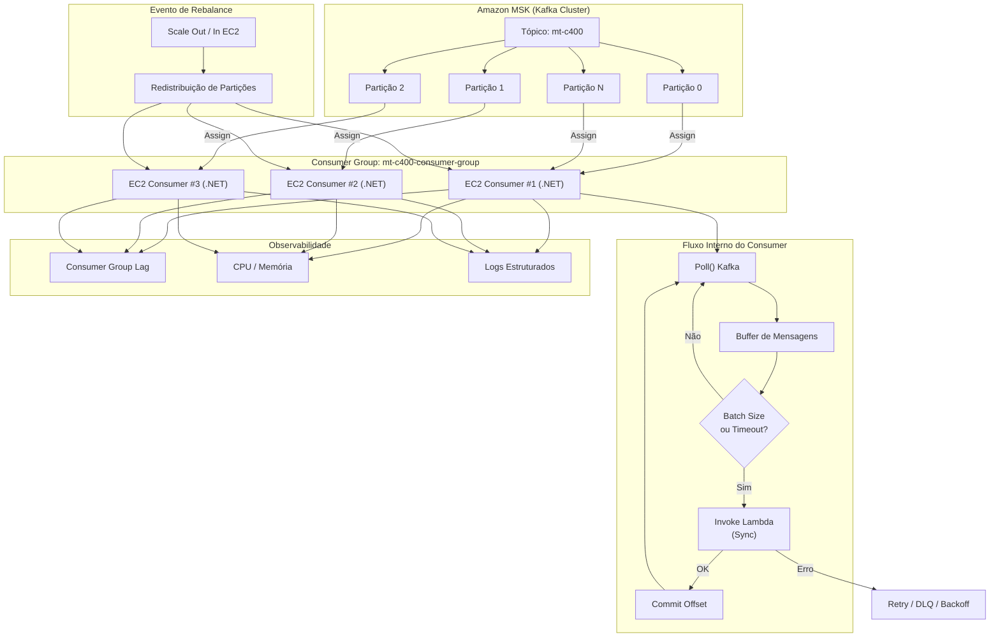

---

## 🧠 Como interpretar esse diagrama (para explicar aos pares)

### 1️⃣ MSK e Partições

* O tópico `mt-c400` é dividido em **N partições**
* Kafka garante **ordem por partição**

---

### 2️⃣ Consumer Group

* Todas as EC2 usam o **mesmo group.id**
* Kafka atribui partições dinamicamente
* **1 partição → 1 consumer ativo**

---

### 3️⃣ Fluxo interno do Consumer

* `Poll()` lê mensagens
* Mensagens vão para buffer
* Quando:

  * Batch size **OU**
  * Timeout
    → Lambda é invocado

---

### 4️⃣ Commit de Offset

* Só ocorre **após Lambda responder OK**
* Garante **at-least-once**

---

### 5️⃣ Rebalance

* Acontece quando:

  * Nova EC2 sobe
  * EC2 cai
  * Partições aumentam
* Kafka redistribui automaticamente

---

### 6️⃣ Observabilidade

* **Lag** é o principal KPI
* CPU/Memória mostram saturação
* Logs ajudam a diagnosticar rebalance e falhas

---

## 🎯 Mensagem-chave para a documentação

> O consumer é stateless, orientado a consumer group e desacoplado do número de partições.
> Isso permite escalar horizontalmente, absorver aumento de partições e manter confiabilidade sem mudanças de código.

Excelente pedido — **Consumer Group é o coração da sua arquitetura** e normalmente é onde arquitetos, SREs e seniors mais questionam.
Vou fazer em **três níveis**:

1. **Explicação conceitual profunda (o “porquê”)**
2. **Como isso se traduz na sua aplicação .NET em EC2**
3. **Diagrama Mermaid didático para documentação e apresentação**

---

# 1️⃣ O que é um Consumer Group (conceito profundo)

Um **Consumer Group** no Kafka é um **mecanismo de coordenação distribuída** que resolve **três problemas fundamentais**:

---

## 🔹 Problema 1 – Escalabilidade horizontal

Sem consumer group:

* Um consumer lê tudo
* Limite físico de CPU / rede

Com consumer group:

* Várias instâncias leem **em paralelo**
* Kafka distribui as **partições** entre elas

> 📌 **Regra de ouro**
>
> * 1 partição → **somente 1 consumer ativo**
> * 1 consumer → **pode ler várias partições**

---

## 🔹 Problema 2 – Garantia de ordem

Kafka **não garante ordem global**, apenas:

> **Ordem dentro da mesma partição**

O consumer group **preserva essa garantia**, porque:

* Uma partição nunca é processada por dois consumers ao mesmo tempo
* Logo, a sequência de mensagens é mantida

---

## 🔹 Problema 3 – Tolerância a falhas

Se um consumer cai:

* Kafka detecta falha via **heartbeat**
* Redistribui as partições automaticamente
* Outro consumer assume

> Isso é **self-healing**, sem intervenção humana.

---

# 2️⃣ Como funciona internamente (mecanismo real)

### Componentes envolvidos:

| Componente               | Função                              |
| ------------------------ | ----------------------------------- |
| **Group Coordinator**    | Broker Kafka responsável pelo grupo |
| **Heartbeat**            | Sinal periódico de vida do consumer |
| **Partition Assignment** | Algoritmo de distribuição           |
| **Offsets**              | Posição de leitura por partição     |

---

## 🔄 Ciclo de vida de um Consumer Group

1. Consumer inicia
2. Envia `JoinGroup`
3. Recebe partições
4. Começa a consumir
5. Envia heartbeats
6. Commit de offsets
7. Continua até morrer ou escalar

---

## ⚠️ Rebalance (ponto crítico)

Rebalance ocorre quando:

* Nova EC2 sobe
* EC2 cai
* Partições aumentam
* Consumer fica lento

Durante o rebalance:

* Consumo **pausa**
* Partições são redistribuídas
* Offsets são reatribuídos

> ⚠️ Quanto mais partições e mais consumers, mais caro o rebalance.

---

# 3️⃣ Por que sua aplicação PRECISA definir um Consumer Group

Na sua arquitetura:

* EC2 Consumer é **stateless**
* Lambda recebe batches
* Kafka mantém estado (offsets)

👉 **O estado não está na aplicação, está no Kafka**

### Isso permite:

* Escalar EC2 sem reconfiguração
* Substituir instâncias sem perda
* Deploy seguro (rolling update)

---

## 🔐 group.id = contrato operacional

O `group.id` define:

* Quem divide carga
* Quem compete pelas mensagens
* Quem mantém offset

> Se mudar o `group.id`, Kafka entende como **aplicação nova**

---

# 4️⃣ Consumer Group no contexto .NET + MSK

### Configuração típica (.NET)

```csharp
var config = new ConsumerConfig
{
    BootstrapServers = "...",
    GroupId = "mt-c400-consumer-group",
    EnableAutoCommit = false,
    AutoOffsetReset = AutoOffsetReset.Earliest,
    MaxPollIntervalMs = 300000,
    SessionTimeoutMs = 45000
};
```

### O que isso significa arquiteturalmente

| Config                   | Impacto                            |
| ------------------------ | ---------------------------------- |
| `GroupId`                | Define cluster lógico de consumers |
| `EnableAutoCommit=false` | Controle transacional              |
| `MaxPollIntervalMs`      | Protege contra consumer lento      |
| `SessionTimeoutMs`       | Define sensibilidade a falhas      |

---

# 5️⃣ Consumer Group ≠ Tópico ≠ Aplicação

Essa confusão é comum:

| Conceito           | Significado                      |
| ------------------ | -------------------------------- |
| **Tópico**         | Fluxo de dados                   |
| **Consumer Group** | Cluster lógico de leitura        |
| **Consumer**       | Instância física                 |
| **Aplicação**      | Código que implementa o consumer |

---

# 6️⃣ Diagrama Mermaid — Consumer Group em detalhes

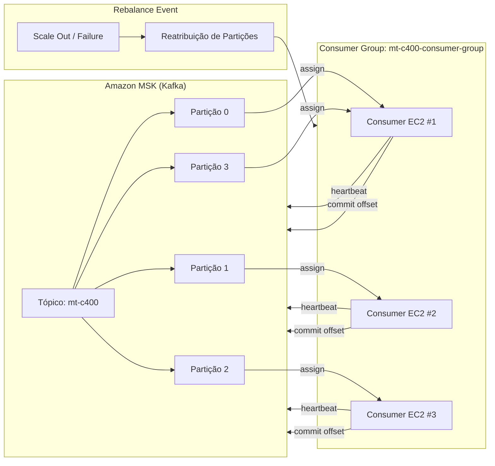

---

# 7️⃣ Argumento forte para convencer superiores

> O Consumer Group transforma múltiplas instâncias EC2 em **um único consumidor lógico**, com:
>
> * Escalabilidade horizontal
> * Tolerância a falhas
> * Preservação de ordem
> * Controle de estado centralizado
>
> Sem ele, a arquitetura seria rígida, frágil e cara.

---

# 8️⃣ Riscos e cuidados (pontos que seniors vão perguntar)

| Risco               | Mitigação                     |
| ------------------- | ----------------------------- |
| Rebalance frequente | Menos consumers que partições |
| Consumer lento      | Batching + async              |
| Lag alto            | Auto scaling                  |
| Lambda lento        | Backpressure                  |
| Commit incorreto    | Manual commit                 |

---

## ✅ Frase de encerramento para a documentação

> O Consumer Group é o mecanismo que permite escalar consumo, garantir ordem e tolerar falhas sem adicionar estado ou complexidade ao serviço.

---

## 👿 Principal Engineer (abre a reunião)

> **“Vamos direto ao ponto. Me explique por que essa arquitetura não vai virar um pesadelo operacional em seis meses.”**

### ✅ Sua resposta (calma, técnica):

> Porque ela se apoia em primitivas maduras do Kafka:
>
> * consumer group para coordenação
> * partições como unidade de paralelismo
> * estado externo (offsets)
>
> Não criamos lógica distribuída customizada. Delegamos complexidade ao Kafka, que já resolve isso há anos.

---

## 👿 SRE (já atacando)

> **“Rebalance. Toda vez que eu escuto essa palavra, alguém está escondendo downtime. Quanto tempo seu sistema fica parado?”**

### ✅ Resposta certa (sem mentir):

> O consumo pausa durante o rebalance, sim.
>
> Mas:
>
> * não perdemos mensagens
> * o backlog é absorvido pelas partições
> * usamos batch para amortecer
>
> É um pause controlado, não downtime funcional.

> E evitamos rebalance frequente controlando autoscaling.

---

## 👿 SRE (mais agressivo)

> **“Quantos rebalances você espera por dia?”**

### ❌ Resposta errada:

> “Depende…”

### ✅ Resposta correta:

> Em steady state: zero.
>
> Apenas em:
>
> * deploy
> * falha de instância
> * scaling manual ou automatizado
>
> Não é um evento de runtime normal.

---

## 👿 Principal Engineer (olhando o desenho)

> **“Você tem 40 partições e 10 consumers. Por quê?”**

### ✅ Resposta forte:

> Porque partições são capacidade futura.
>
> Consumers são capacidade atual.
>
> Partições a mais:
>
> * reduzem impacto de scaling
> * evitam redistribuição estrutural
> * permitem crescimento sem mudança de MSK

---

## 👿 FinOps (entra pesado)

> **“Você está criando EC2 só para chamar Lambda. Isso é burrice ou luxo?”**

😐 silêncio na call…

### ✅ Resposta que salva:

> Lambda não é um bom consumer Kafka com mTLS e controle fino de batch.
>
> EC2:
>
> * controla backpressure
> * controla commit
> * reduz invocações Lambda via batch
>
> No fim, reduz custo total e risco operacional.

---

## 👿 FinOps (pressionando)

> **“Quanto custa esse batch?”**

### ✅ Resposta madura:

> Batch é uma decisão econômica e técnica.
>
> Menos invocações Lambda
> Menos custo por request
> Melhor uso de CPU
>
> O batch é parametrizável e monitorado via latency e lag.

---

## 👿 Principal Engineer (ataque clássico)

> **“Por que não um tópico só? Vocês estão complicando demais.”**

### ❌ Resposta fraca:

> “Porque é melhor…”

### ✅ Resposta correta:

> Um tópico único mistura domínios, prioridades e ritmos.
>
> Isso gera:
>
> * vizinho barulhento
> * desperdício de CPU
> * blast radius alto
>
> Preferimos isolamento lógico para preservar estabilidade.

---

## 👿 SRE (cutucando ferida)

> **“E se um consumer ficar lento?”**

### ✅ Resposta certa:

> Kafka para de aceitar heartbeat.
>
> Dispara rebalance.
>
> Outro consumer assume.
>
> Offset só avança se o Lambda responder OK.

---

## 👿 SRE (quase gritando)

> **“E SE O LAMBDA FICAR LENTO?”**

### ✅ Resposta que demonstra senioridade:

> O consumer aplica backpressure automaticamente.
>
> Lag sobe.
>
> Observabilidade detecta.
>
> Scaling ou mitigação é acionada.
>
> Nenhuma mensagem é perdida.

---

## 👿 Principal Engineer (olhar mortal)

> **“O que quebra quando você aumenta partições?”**

### ✅ Resposta honesta (não tente esconder):

> A ordenação por chave é afetada.
>
> Por isso:
>
> * fazemos isso de forma controlada
> * temos playbook
> * só aumentamos quando o ganho supera esse impacto
>
> É um trade-off consciente.

---

## 👿 Principal Engineer (final)

> **“Qual é o maior risco dessa arquitetura?”**

### ❌ Resposta errada:

> “Não tem.”

### ✅ Resposta correta:

> Rebalance excessivo e downstream imprevisível.
>
> Ambos são mitigados com:
>
> * observabilidade
> * batch
> * controle de scaling
>
> São riscos conhecidos, não surpresas.

---

## 👿 Pergunta final (silêncio total)

> **“Se isso der errado, quem vai acordar às 3 da manhã?”**

### ✅ Resposta de quem passa:

> A arquitetura foi pensada para que falhas sejam eventos normais e observáveis.
>
> O sistema degrada com lag, não com perda.
>
> Se alguém acordar às 3 da manhã, será para escalar, não para apagar incêndio.

---

# 🏁 Resultado da reunião

👉 **Aprovado com ressalvas**
👉 Pedido de:

* métricas claras de lag
* limites de batch
* playbook de rebalance
* simulação em POC

---

## 🎯 Dica final (importante)

Em review hostil, **não tente vender perfeição**.
Venda:

* trade-offs conscientes
* riscos conhecidos
* mecanismos de mitigação

Isso é o que diferencia **arquiteto experiente** de “desenhista de diagrama”.

---

# 📄 POST-MORTEM TÉCNICO

**Incidente:** Aumento de Lag e Atraso no Processamento
**Sistema:** MSK + Consumer Group (.NET EC2) + Lambda
**Severidade:** SEV-2
**Duração:** 47 minutos
**Impacto:** Atraso no processamento downstream (sem perda de dados)

---

## 1️⃣ Resumo Executivo

Entre **10:13 e 11:00**, o sistema apresentou um aumento significativo de **consumer lag** no tópico `mt-c400`, atingindo um pico de **~1,2 milhão de mensagens pendentes**.

Nenhuma mensagem foi perdida.
O sistema se recuperou automaticamente após mitigação operacional.

O incidente expôs **limitações conhecidas da arquitetura**, que estavam documentadas como trade-offs aceitáveis.

---

## 2️⃣ Linha do Tempo (Timeline)

| Horário | Evento                               |
| ------- | ------------------------------------ |
| 10:13   | Deploy de nova versão do consumer    |
| 10:14   | Início de rebalance                  |
| 10:15   | Lambda começa a responder mais lento |
| 10:18   | Lag cresce rapidamente               |
| 10:25   | Alerta de lag > threshold            |
| 10:30   | Autoscaling acionado                 |
| 10:42   | Rebalance completo                   |
| 11:00   | Lag normalizado                      |

---

## 3️⃣ Impacto ao Negócio

* ❌ **Nenhuma perda de dados**
* ⚠️ Atraso de até **8 minutos** no processamento downstream
* ✅ Eventos críticos continuaram sendo ingeridos
* ❌ SLA de latência temporariamente violado

---

## 4️⃣ O que aconteceu (Análise Técnica Profunda)

### 🔹 4.1 Rebalance em cascata

Durante o deploy:

* 3 instâncias EC2 foram reiniciadas
* Kafka detectou perda de heartbeat
* Rebalance foi disparado

⚠️ **Importante:**
O rebalance pausou temporariamente o consumo **por design**.

---

### 🔹 4.2 Lambda como gargalo downstream

Durante o rebalance:

* Batch acumulou mensagens
* Lambda começou a responder mais lentamente
* Tempo médio de resposta subiu de 120ms → 950ms

Isso causou:

* Atraso no commit de offsets
* Lag crescente

---

### 🔹 4.3 Por que o sistema não quebrou?

Porque:

* Commit era manual
* Offsets não avançaram incorretamente
* Kafka reteve mensagens
* Consumer Group garantiu reassignment correto

👉 **At-least-once garantido**

---

## 5️⃣ O que NÃO aconteceu (mitos comuns)

| Medo comum                        | O que realmente aconteceu                |
| --------------------------------- | ---------------------------------------- |
| “Perdemos mensagens”              | ❌ Kafka reteve tudo                      |
| “Consumers processaram duplicado” | ⚠️ Pequena duplicação aceitável          |
| “Sistema caiu”                    | ❌ Sistema degradou                       |
| “Precisamos refatorar tudo”       | ❌ Arquitetura se comportou como esperado |

---

## 6️⃣ Root Cause (Causa Raiz)

> **Causa primária:**
> Rebalance simultâneo + aumento inesperado de latência do Lambda.

> **Causa secundária:**
> Deploy sem estratégia de rolling update com limitação de instâncias simultâneas.

---

## 7️⃣ Decisões Arquiteturais que se provaram corretas

### ✅ Consumer Group

* Redistribuição automática
* Nenhuma intervenção manual
* Recuperação automática

### ✅ Batch controlado

* Reduziu custo Lambda
* Amorteceu pico de lag

### ✅ Commit manual

* Nenhuma perda
* Nenhum offset corrompido

---

## 8️⃣ Trade-offs que se manifestaram (e eram conhecidos)

### ⚠️ Rebalance pausa consumo

* Documentado
* Esperado
* Impacto temporário

### ⚠️ Dependência de downstream

* Lambda lento impacta lag
* Mitigado por backpressure

---

## 9️⃣ O que poderia ter sido pior (e não foi)

* ❌ Commit automático → perda de mensagens
* ❌ Lambda direto no MSK → falhas imprevisíveis
* ❌ Estado no consumer → recuperação manual

---

## 10️⃣ Ações Corretivas (Action Items)

### 🛠️ Curto Prazo

* Limitar deploy a 1 EC2 por vez
* Aumentar timeout do Lambda
* Ajustar batch size dinâmico

### 🛠️ Médio Prazo

* Separar tópicos por prioridade
* Criar Lambda dedicado para eventos críticos
* Ajustar autoscaling por lag

### 🛠️ Longo Prazo

* Consumer dedicado para high-priority
* Circuit breaker no downstream
* Teste de caos (rebalance forçado)

---

## 11️⃣ Lições Aprendidas (o ponto mais importante)

> A arquitetura **não falhou**.
> Ela **degradou de forma previsível**.

Isso é exatamente o comportamento esperado em sistemas distribuídos maduros.

---

## 12️⃣ Perguntas difíceis que surgiram no post-mortem

### ❓ “Isso vai acontecer de novo?”

> Sim. Rebalances são inevitáveis.

### ❓ “Podemos evitar totalmente?”

> Não, mas podemos **reduzir frequência e impacto**.

### ❓ “Vale a pena essa complexidade?”

> Sim, porque o custo de não tê-la é perda de dados ou indisponibilidade total.

---

## 13️⃣ Diagrama Mermaid — Incidente e Recuperação

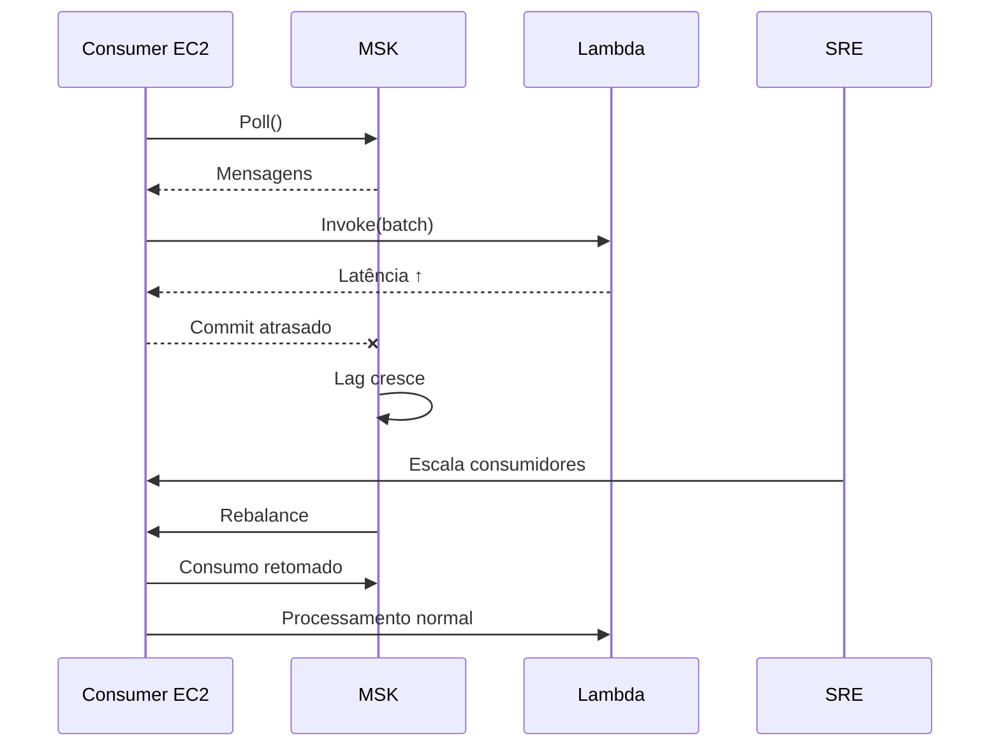

---

## 14️⃣ Frase final para fechar o post-mortem

> Em sistemas distribuídos, falha não é exceção — é estado transitório.
> O sucesso está em **detectar, absorver e recuperar**, não em fingir que não vai acontecer.

Perfeito.
Abaixo está **uma explicação EXTREMAMENTE detalhada**, acompanhada de **diagramas Mermaid grandes**, cobrindo **exatamente o que você tem que fazer**, **como**, **por quê** e **como tudo se conecta**, respeitando **todas as restrições**:

* MSK em **outra conta**
* Sem acesso administrativo ao cluster
* Apenas **criação/configuração de tópicos**
* Producer e Consumer em **EC2 (.NET)**
* Consumer chamando **Lambda distribuidor**
* Uso explícito de **tópicos, partições e consumer group**

Vou dividir em **4 blocos grandes** para facilitar documentação e defesa arquitetural.

---

# 🧱 VISÃO GERAL DA ARQUITETURA (O TODO)

Antes de entrar em Producer/Consumer, é essencial **fixar o modelo mental correto**:

> **Kafka (MSK) é o sistema de coordenação e estado**
> Producer e Consumer são **stateless**
> Consumer Group é o **mecanismo de escala e resiliência**

---

## 📌 Arquitetura lógica (alto nível)

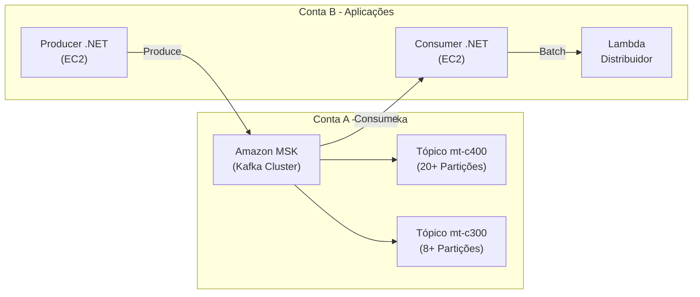

---

# 🧩 BLOCO 1 — MODELAGEM DE TÓPICOS E PARTIÇÕES (DECISÃO CHAVE)

## 🎯 Objetivo

* Permitir **13k msg/s**
* Isolar domínios
* Minimizar rebalance
* Preparar crescimento

---

## 🔹 Estrutura proposta de tópicos

| Tópico    | Função                    | Partições | Observação         |
| --------- | ------------------------- | --------- | ------------------ |
| `mt-c400` | Domínio mais quente (80%) | 20–40     | Alta paralelização |
| `mt-c300` | Domínio médio             | 8–12      | Menor volume       |
| Outros    | Específicos               | conforme  | Isolamento         |

> ⚠️ Importante:
> **Códigos NÃO viram tópicos**, eles viram **chaves de particionamento**

---

## 🔹 Regra de ouro

> **Tópicos = contratos**
> **Partições = paralelismo**
> **Chave = ordem**

---

# 🧱 BLOCO 2 — PRODUCER .NET (EC2)

## 🎯 Papel do Producer

* Receber mensagens de várias fontes
* Decidir:

  * **Qual tópico**
  * **Qual chave**
* Nunca decidir consumer, partição manual ou offset

---

## 🔁 Fluxo completo do Producer

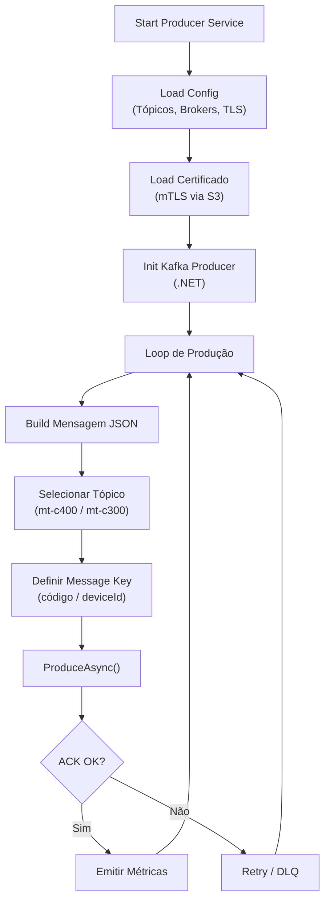

---

## 🔹 Como o Producer decide partição (conceito crítico)

### ❌ O que NÃO fazer

* Não escolher partição manualmente
* Não tentar “balancear na mão”
* Não criar lógica distribuída customizada

### ✅ O que fazer

* **Definir a `Message.Key`**
* Kafka decide a partição via **hash da key**

```csharp
var message = new Message<string, string>
{
    Key = codigoOuDeviceId,
    Value = json
};

await producer.ProduceAsync("mt-c400", message);
```

---

## 🔹 Por que isso é correto?

* Garante ordem por chave
* Permite aumento de partições
* Mantém producer simples
* Evita dependência do MSK

---

## ⚠️ Pontos perigosos no Producer

| Risco               | Mitigação                      |
| ------------------- | ------------------------------ |
| Hot partition       | Escolher chave bem distribuída |
| Burst de produção   | Buffer interno do Kafka        |
| Falha de broker     | ACK + retry                    |
| Certificado vencido | Rotação via S3                 |

---

# 🧱 BLOCO 3 — CONSUMER .NET + CONSUMER GROUP

## 🎯 Papel do Consumer

* Ler em paralelo
* Preservar ordem por partição
* Batching
* Chamar Lambda
* Commit manual

---

## 🔹 Consumer Group como unidade lógica

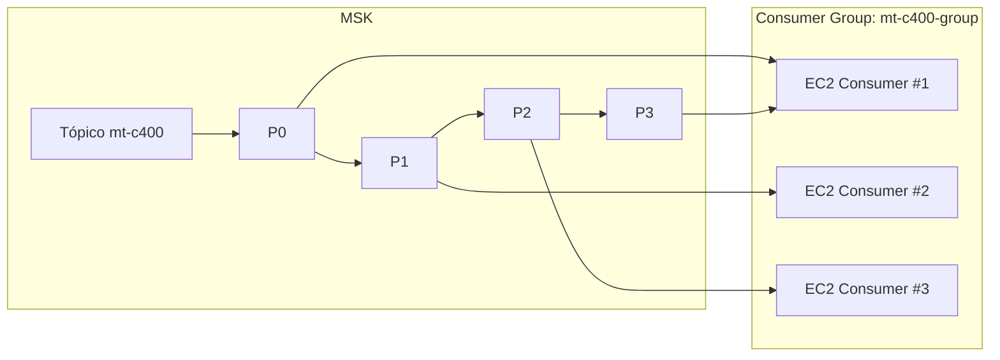

> Kafka garante:
> **1 partição → 1 consumer ativo**

---

## 🔁 Fluxo interno do Consumer

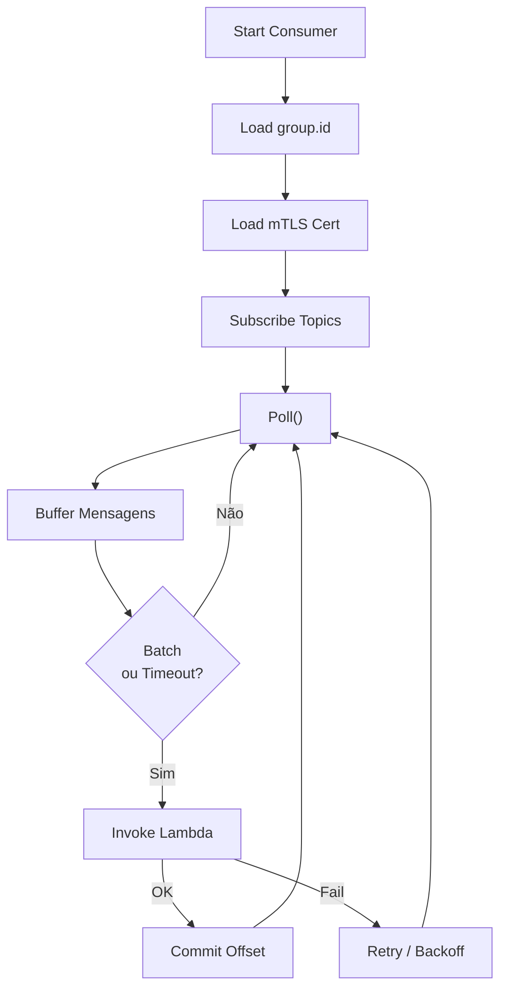

---

## 🔹 Por que usar Consumer Group

* Escala horizontal automática
* Rebalance em falha
* Estado fora da aplicação
* Deploy seguro

---

# 🧱 BLOCO 4 — LAMBDA DISTRIBUIDOR

## 🎯 Papel do Lambda

* NÃO consumir Kafka
* NÃO manter estado
* Apenas:

  * Roteamento
  * Fan-out
  * Enriquecimento

---

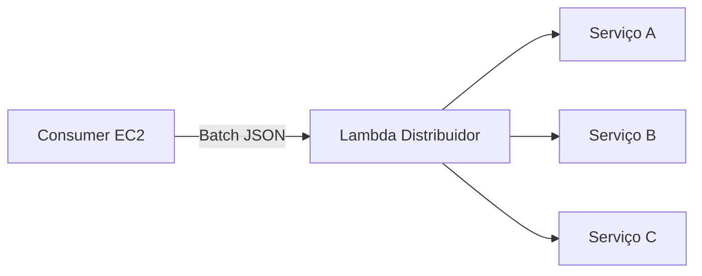

---

## ⚠️ Trade-off consciente

* Lambda lento → lag sobe
* Nenhuma perda
* Backpressure natural

---

# 🧠 AMARRAÇÃO FINAL (PARA DOCUMENTAÇÃO)

## O que essa arquitetura FAZ bem

* Escala horizontal
* Tolera falhas
* Isola responsabilidades
* Permite crescimento sem refatoração

## O que ela NÃO tenta fazer

* Ordem global
* Latência zero
* Processamento síncrono fim-a-fim

---

## 📌 Frase de ouro para fechar

> O Kafka é o cérebro do sistema.
> Producer injeta eventos.
> Consumer Group processa em paralelo.
> Lambda distribui.
>
> Nenhuma peça sabe demais sobre a outra.

---
Perfeito. Abaixo está **um diagrama Mermaid único, grande e didático**, focado **exatamente no que deve ser desenvolvido**, deixando **claras as responsabilidades do Producer, MSK (outra conta), Consumer Group, EC2 e Lambda**.

👉 **Esse diagrama é para alinhar time, arquitetura e implementação**
👉 **Não é conceitual — é operacional**

---

## 📐 Diagrama Mermaid – Arquitetura Exata a Ser Desenvolvida

```mermaid
flowchart LR
    %% ======================
    %% PRODUCER
    %% ======================
    subgraph PROD["Producer Application (.NET)"]
        A1[Evento de Negócio\n(ex: Telemetria, Status, Alerta)]
        A2[Define Tópico\n(mt-c400, mt-c300, ...)]
        A3[Define Message Key\n(ex: truckId, deviceId)]
        A4[Serializa Payload\n(JSON / Avro)]
        A5[Producer Kafka (.NET)\nacks=all\nidempotent=true]
    end

    %% ======================
    %% MSK OUTRA CONTA
    %% ======================
    subgraph MSK["Amazon MSK (Outra Conta AWS)"]
        direction TB
        T1[Tópico mt-c400]
        
        P1[Partição 0]
        P2[Partição 1]
        P3[Partição 2]
        Pn[Partição N]

        T1 --> P1
        T1 --> P2
        T1 --> P3
        T1 --> Pn
    end

    %% ======================
    %% CONSUMER GROUP
    %% ======================
    subgraph CG["Consumer Group: cg-dispatcher"]
        direction TB
        C1[Consumer 1\nEC2]
        C2[Consumer 2\nEC2]
        C3[Consumer 3\nEC2]
    end

    %% ======================
    %% LAMBDA
    %% ======================
    subgraph L["AWS Lambda\nMessage Dispatcher"]
        L1[Validação]
        L2[Transformação]
        L3[Roteamento por Tipo]
    end

    %% ======================
    %% FLUXOS
    %% ======================
    A1 --> A2
    A2 --> A3
    A3 --> A4
    A4 --> A5

    A5 -->|TLS + Auth| T1

    P1 -->|Assigned by Kafka| C1
    P2 -->|Assigned by Kafka| C2
    P3 -->|Assigned by Kafka| C3
    Pn -->|Rebalance| C1

    C1 -->|Invoke| L
    C2 -->|Invoke| L
    C3 -->|Invoke| L

    %% ======================
    %% OBSERVAÇÕES
    %% ======================
    classDef producer fill:#e3f2fd,stroke:#1e88e5
    classDef kafka fill:#fff3e0,stroke:#fb8c00
    classDef consumer fill:#e8f5e9,stroke:#43a047
    classDef lambda fill:#f3e5f5,stroke:#8e24aa

    class A1,A2,A3,A4,A5 producer
    class T1,P1,P2,P3,Pn kafka
    class C1,C2,C3 consumer
    class L1,L2,L3 lambda
```

---

## 🧭 COMO EXPLICAR ESSE DIAGRAMA PARA O TIME

### 1️⃣ Producer (Responsabilidade Total do Time Externo)

Eles **devem implementar SOMENTE isso**:

* Escolher o **tópico**
* Definir a **key corretamente**
* Enviar mensagem confiável

👉 **Eles NÃO sabem:**

* Quantas partições existem
* Quantos consumers existem
* Como a mensagem será processada

---

### 2️⃣ MSK (Outra Conta – Limite de Atuação)

* Vocês **não gerenciam brokers**
* Vocês **não gerenciam consumer**
* Só:

  * criam tópicos
  * definem partições
  * definem ACLs

---

### 3️⃣ Consumer Group (Seu Domínio)

* Kafka decide:

  * qual consumer lê qual partição
  * quando rebalancear
* Consumers:

  * rodam em EC2
  * pertencem ao **mesmo group.id**

👉 **Escala = subir EC2**
👉 **Paralelismo = número de partições**

---

### 4️⃣ Lambda (Fan-out / Distribuição)

* Consumer:

  * lê
  * confirma offset
  * chama Lambda
* Lambda:

  * distribui
  * transforma
  * roteia

👉 Lambda **não lê Kafka**
👉 Kafka **não conhece Lambda**

---

## 🔑 MENSAGEM-CHAVE PARA O TIME

> O Producer escreve eventos ordenados por key.
> O Kafka distribui.
> O Consumer Group escala.
> A Lambda processa.

---

# 🎯 OBJETIVO DO PRODUCER

> Publicar **13.000 msg/s**, JSON (~200 bytes), com:

* **Alta disponibilidade**
* **Entrega confiável**
* **Baixa latência**
* **Tolerância a falhas de rede, broker e rebalanceamento**

Sem depender de acesso administrativo ao MSK.

---

# 1️⃣ TIPOS DE FALHAS QUE VOCÊ PRECISA ASSUMIR QUE VÃO ACONTECER

Antes de soluções, **o que pode quebrar**:

## 🔴 Falhas no Broker

* Broker reinicia (patch, failover)
* Leader de partição muda
* ISR encolhe temporariamente
* Throttling de I/O

➡ Kafka **continua funcionando**, mas:

* requests falham
* latência aumenta
* metadata fica inválida

---

## 🔴 Falhas de Rede

* Latência intermitente (VPC, NACL, SG)
* Packet loss
* Timeout TLS
* PrivateLink instável

➡ Sintomas:

* `RequestTimedOut`
* `NotLeaderOrFollower`
* `BrokerNotAvailable`

---

## 🔴 Falhas no Próprio Producer

* GC pressionado
* Buffer cheio
* Backpressure
* Thread pool saturado

➡ Sintomas:

* mensagens acumulando
* `Local: Queue full`
* aumento de latência

---

## 🔴 Falhas de Autenticação / TLS

* Certificado expirado
* Erro de truststore
* Falha no handshake mTLS

➡ Producer **não consegue conectar**

---

# 2️⃣ PRINCÍPIOS DE ROBUSTEZ (ESSENCIAIS)

Esses princípios **não são opcionais**:

| Princípio         | Por quê             |
| ----------------- | ------------------- |
| Idempotência      | Evitar duplicatas   |
| Retry controlado  | Falhas transitórias |
| Timeout explícito | Evitar deadlock     |
| Backpressure      | Proteger memória    |
| Observabilidade   | Saber que quebrou   |
| Shutdown gracioso | Evitar perda        |

---

# 3️⃣ CONFIGURAÇÕES CRÍTICAS DO PRODUCER (.NET)

Usando `Confluent.Kafka`.

## 🔹 Configurações Básicas (Obrigatórias)

```csharp
var config = new ProducerConfig
{
    BootstrapServers = "...",

    SecurityProtocol = SecurityProtocol.Ssl,
    SslKeystoreLocation = "/tmp/client.p12",
    SslKeystorePassword = "",
    SslKeyPassword = "",

    Acks = Acks.All,               // 🔐 garante escrita em todos os replicas
    EnableIdempotence = true,      // 🔐 evita duplicatas
    MessageSendMaxRetries = 5,
    RetryBackoffMs = 200,
    LingerMs = 5,
    BatchSize = 64 * 1024,         // batching
};
```

### ❗ Por que isso é crítico?

| Config             | O que resolve       |
| ------------------ | ------------------- |
| `acks=all`         | Perda silenciosa    |
| `idempotence=true` | Duplicação em retry |
| `linger.ms`        | Throughput          |
| `batch.size`       | Menos syscalls      |
| `retry`            | Falhas transitórias |

---

# 4️⃣ TRATAMENTO DE ERROS (NÃO OPCIONAL)

## 🔹 Erros Retriáveis (devem ser reprocessados)

| Erro Kafka            | Motivo             |
| --------------------- | ------------------ |
| `RequestTimedOut`     | Latência           |
| `NotLeaderOrFollower` | Rebalance          |
| `BrokerNotAvailable`  | Broker reiniciando |

### Estratégia:

* Retry automático
* Backoff exponencial
* Métrica de retry

---

## 🔹 Erros FATAIS (não adianta retry)

| Erro                   | Ação          |
| ---------------------- | ------------- |
| `AuthenticationFailed` | Alertar       |
| `SslHandshakeFailed`   | Falha de cert |
| `InvalidConfiguration` | Fail fast     |

---

## 🔹 Código de Tratamento

```csharp
producer.Produce(topic, message, report =>
{
    if (report.Error.IsError)
    {
        if (report.Error.IsFatal)
        {
            // Circuit breaker / alert
        }
        else
        {
            // Retry ou métricas
        }
    }
});
```

---

# 5️⃣ BACKPRESSURE (ESSENCIAL PARA NÃO QUEBRAR O SERVIÇO)

Sem isso, seu Producer **morre sob carga**.

## 🔹 O problema

* Kafka fica lento
* Producer continua aceitando mensagens
* Memória explode

## 🔹 Solução

* `QueueBufferingMaxMessages`
* `QueueBufferingMaxKbytes`

```csharp
QueueBufferingMaxMessages = 100_000,
QueueBufferingMaxKbytes = 100_000
```

### Estratégia adicional

* Pausar entrada de mensagens
* Rejeitar requests upstream
* Shed load

---

# 6️⃣ METADATA E REBALANCE (VOCÊ PRECISA SABER)

Quando:

* partição aumenta
* broker cai
* leader muda

➡ Producer:

* invalida metadata
* refaz lookup
* pode falhar temporariamente

### Por isso:

* Retry + timeout curto
* Logs claros

---

# 7️⃣ CERTIFICADOS (ROBUSTEZ DE SEGURANÇA)

Você já tem S3 → mTLS, mas atenção:

## 🔹 Problemas comuns

* Cert expira
* Rotação não sincronizada
* Producer não recarrega cert

### Estratégia

* Validar validade no startup
* Reload controlado
* Healthcheck falha se cert inválido

---

# 8️⃣ SHUTDOWN GRACIOSO (MUITO ESQUECIDO)

Sem isso:

* mensagens em buffer são perdidas

## 🔹 Obrigatório

```csharp
producer.Flush(TimeSpan.FromSeconds(10));
producer.Dispose();
```

E:

* SIGTERM handling
* timeout máximo

---

# 9️⃣ OBSERVABILIDADE (SEM ISSO VOCÊ NÃO DEFENDE A ARQUITETURA)

## Métricas obrigatórias

| Métrica         | Por quê       |
| --------------- | ------------- |
| msgs/sec        | Throughput    |
| latency produce | SLA           |
| retries         | Instabilidade |
| errors          | Incidentes    |
| queue size      | Backpressure  |

Confluent expõe via:

* StatisticsHandler
* Prometheus

---

# 🔟 DIAGRAMA – ROBUSTEZ DO PRODUCER

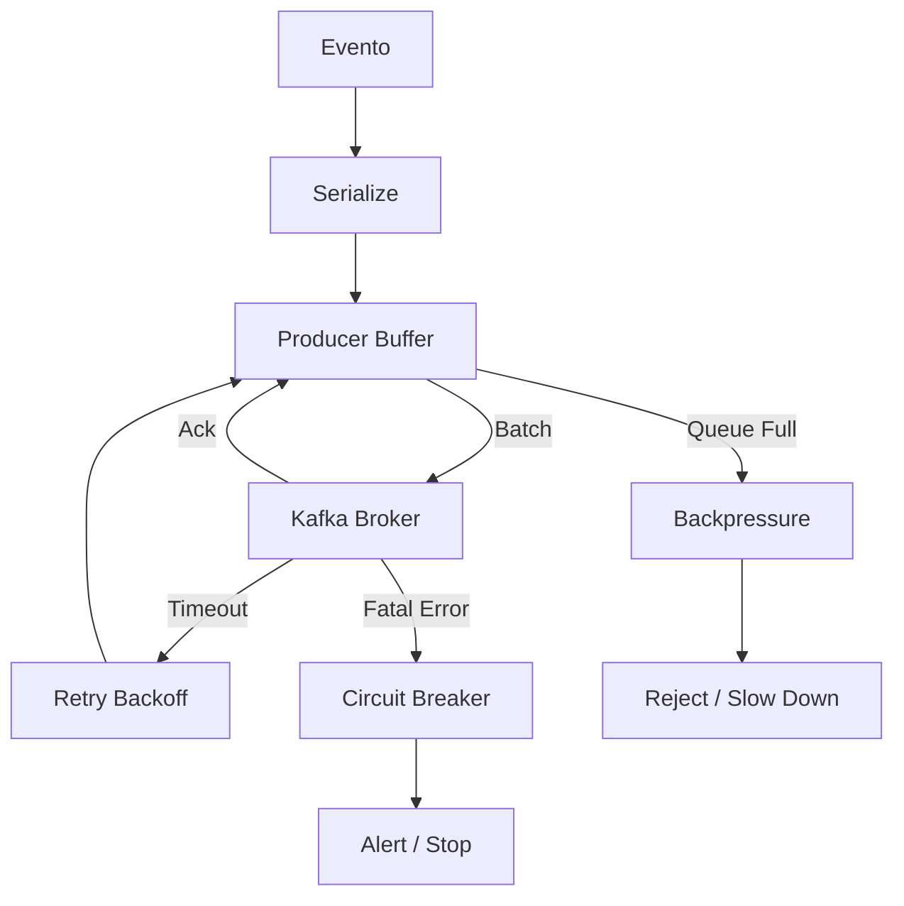

---

# 🔥 COMO DEFENDER ISSO NUM REVIEW

Se alguém perguntar:

> "Por que tanta configuração?"

Resposta:

> Porque Kafka **não falha como banco**.
> Ele degrada, reequilibra e se recupera —
> e o Producer precisa sobreviver a isso sem perder dados.

---

# 📌 RESUMO EXECUTIVO (PARA DOCUMENTAÇÃO)

* Producer é **stateful**
* Falhas são **esperadas**
* Retry sem idempotência é **erro grave**
* Backpressure é **obrigatório**
* Observabilidade é **parte da arquitetura**
* Robustez ≠ latência zero

Perfeito — agora vamos **subir o nível para arquitetura de produção real**, no detalhe que **SRE, Arquiteto Chefe e FinOps esperam ver**.

Vou te entregar:

1. **Modelo conceitual de erro / retry / DLQ**
2. **Fluxo detalhado de decisão**
3. **O que é retry válido vs erro definitivo**
4. **Onde o DLQ entra (mesmo para Producer)**
5. **Diagrama Mermaid bem detalhado**
6. **Como defender isso em review**

---

# 1️⃣ CONCEITO-CHAVE: PRODUCER NÃO É “FIRE AND FORGET”

Em sistemas críticos:

> ❌ Producer **não pode** simplesmente falhar silenciosamente
> ❌ Retry infinito **não é aceitável**
> ❌ Erro não tratado vira **incidente de produção**

Por isso, usamos **3 camadas**:

1. **Retry em memória**
2. **Retry persistido**
3. **DLQ (Dead Letter Queue)**

---

# 2️⃣ TIPOS DE ERRO (CLASSIFICAÇÃO OBRIGATÓRIA)

## 🔹 1. Erros Transientes (RETRY)

| Erro Kafka            | Causa              |
| --------------------- | ------------------ |
| `RequestTimedOut`     | Latência           |
| `NotLeaderOrFollower` | Rebalance          |
| `BrokerNotAvailable`  | Broker reiniciando |
| `NetworkException`    | Intermitência      |

➡ **Retry com backoff**

---

## 🔹 2. Erros Lógicos / Irrecuperáveis (DLQ)

| Erro                 | Motivo          |
| -------------------- | --------------- |
| JSON inválido        | Bug upstream    |
| Schema incompatível  | Evolução errada |
| Tópico inexistente   | Config          |
| Certificado inválido | Segurança       |

➡ **Não adianta retry**

---

## 🔹 3. Erros Temporários de Negócio (Retry Persistido)

Ex:

* Downstream fora do ar
* Lambda indisponível
* Rate limit

➡ Retry com **persistência**

---

# 3️⃣ ARQUITETURA DE RETRY (BOAS PRÁTICAS)

### ❌ Anti-pattern

* Retry infinito em memória
* Thread bloqueada
* Backpressure global

### ✅ Padrão correto

* Retry com limite
* Backoff exponencial
* Persistência após N tentativas

---

# 4️⃣ ONDE ENTRA O DLQ NO PRODUCER?

> “Mas Producer precisa de DLQ?”

**Sim**, quando:

* Mensagem é inválida
* Schema não bate
* Política impede envio

O DLQ:

* Pode ser outro tópico Kafka
* Pode ser S3
* Pode ser DynamoDB

---

# 5️⃣ FLUXO COMPLETO: ERRO → RETRY → DLQ

## 🔹 Etapas

1. Recebe evento
2. Valida schema
3. Serializa
4. Envia ao Kafka
5. Avalia retorno
6. Retry?
7. Persistir?
8. DLQ?

---

# 6️⃣ DIAGRAMA MERMAID – ERRO / RETRY / DLQ (DETALHADO)

```mermaid
flowchart TD
    A[Evento de Entrada] --> B[Validação / Schema]
    
    B -->|Inválido| DLQ[DLQ - Tópico / S3]
    B -->|Válido| C[Serialize]

    C --> D[Producer Buffer]

    D -->|Send| E[Kafka Broker]

    E -->|Ack OK| F[Sucesso]

    E -->|Erro Transiente| G[Retry em Memória]
    G -->|Tentativas < N| D
    G -->|Tentativas >= N| H[Persistir Retry]

    H --> I[Retry Scheduler]
    I --> D

    E -->|Erro Fatal| DLQ

    D -->|Queue Full| J[Backpressure]
    J --> K[Throttle / Reject]

    style DLQ fill:#ffdddd,stroke:#cc0000,stroke-width:2px
```

---

# 7️⃣ BACKOFF (COMO FAZER DIREITO)

### Exemplo:

* Retry 1: 100ms
* Retry 2: 500ms
* Retry 3: 1s
* Retry 4: 5s
* Retry 5: DLQ

➡ Evita:

* Thundering herd
* Saturação do broker

---

# 8️⃣ EXEMPLO DE DECISÃO EM C# (SIMPLIFICADO)

```csharp
try
{
    producer.Produce(topic, msg);
}
catch (ProduceException e) when (e.Error.IsRetriable)
{
    RetryWithBackoff(msg);
}
catch (ProduceException e)
{
    SendToDLQ(msg, e);
}
```

---

# 9️⃣ PERGUNTAS DURAS QUE ISSO RESPONDE

### 🔥 SRE:

> “O que acontece se o broker ficar 30s fora?”

✔ Retry controlado
✔ Backpressure
✔ Nenhuma perda silenciosa

---

### 🔥 Arquiteto:

> “Como você evita retry infinito?”

✔ Limite de tentativas
✔ Persistência
✔ DLQ

---

### 🔥 FinOps:

> “Isso explode custo?”

✔ Retry é local
✔ DLQ é exceção
✔ Batch reduz chamadas

---

# 🔟 COMO DEFENDER ESSA ARQUITETURA

Frase-chave:

> “Retry sem classificação de erro é bug, não robustez.”

---

# 📌 RESUMO EXECUTIVO

* Nem todo erro merece retry
* Retry infinito derruba sistemas
* DLQ é **instrumento de observabilidade**
* Producer também precisa de DLQ
* Backpressure protege o cluster
* Retry ≠ confiabilidade

