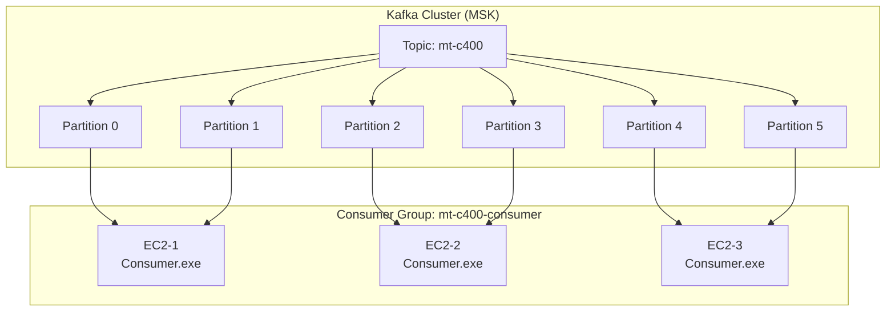
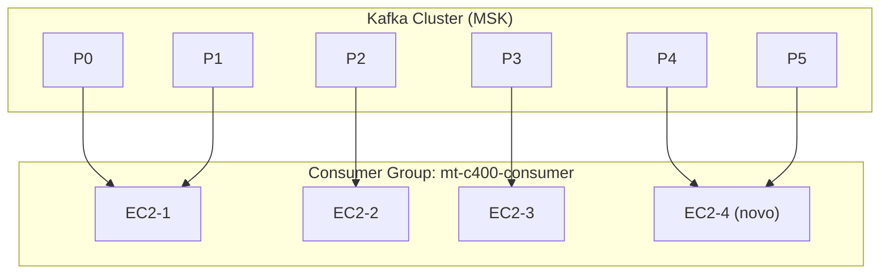
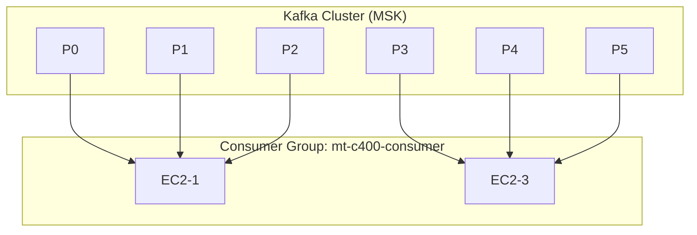
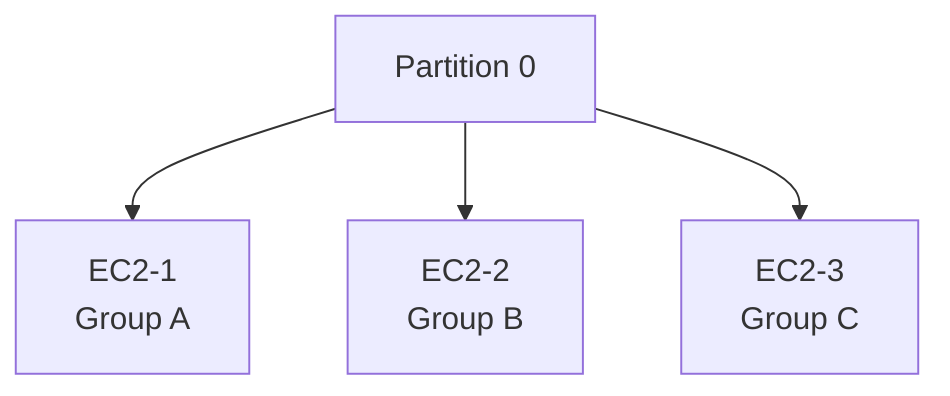

Na pratica, para cada instancia, ou executável que eu executar do consumer ele tem que ter um grupo próprio? ME explique tudo na pratica.

## ❌ RESPOSTA CURTA (O ERRO COMUM)

> **NÃO.**
> Cada instância / executável do consumer **NÃO** deve ter um group próprio.

Se você fizer isso, você **destrói o modelo de escalabilidade do Kafka**.

---

## ✅ RESPOSTA CORRETA (NA PRÁTICA)

> **TODAS as instâncias do MESMO serviço consumidor devem usar o MESMO `group.id`.**

Isso é o que permite:

* divisão automática de carga
* failover
* paralelismo real
* controle de offset consistente

---

## 1️⃣ VAMOS TRAZER ISSO PARA O MUNDO REAL

Imagine o seu serviço:

```text
ConsumerService.exe
```

Você roda esse mesmo executável em:

* EC2-1
* EC2-2
* EC2-3

### Configuração correta:

```text
group.id = mt-c400-consumer
```

👉 **Idêntico em todas as instâncias.**

Kafka entende:

> “Esses 3 processos fazem parte do mesmo time e devem dividir o trabalho.”

---

## 2️⃣ O QUE O KAFKA FAZ COM ISSO

Suponha:

* Tópico `mt-c400`
* 12 partições
* 3 instâncias do consumer

Kafka distribui:

```text
EC2-1 → Partições 0,1,2,3
EC2-2 → Partições 4,5,6,7
EC2-3 → Partições 8,9,10,11
```

Cada partição:

* é consumida por **apenas uma instância**
* mantém ordem
* tem offset independente

---

## 3️⃣ O QUE ACONTECE SE VOCÊ ERRAR O GROUP ID

### ❌ CENÁRIO ERRADO

Você sobe:

```text
EC2-1 → group.id = consumer-1
EC2-2 → group.id = consumer-2
EC2-3 → group.id = consumer-3
```

Kafka entende:

> “Esses são 3 sistemas diferentes.”

Resultado:

* **Cada instância consome TODAS as partições**
* Cada mensagem é processada **3 vezes**
* Triplica custo de Lambda
* Duplica dados downstream
* Incidente garantido

👉 Isso **não é escala**, é replicação.

---

## 4️⃣ ANALOGIA SIMPLES (MAS PRECISA)

### Consumer Group é um “time de trabalho”

* **Time único** → divide tarefas
* **Times diferentes** → cada um faz tudo

Você quer:

* 1 time forte com vários trabalhadores
  Não:
* vários times fazendo o mesmo trabalho

---

## 5️⃣ “ENTÃO COMO EU ESCALO?”

Escala ocorre **automaticamente** quando você:

1. Mantém o mesmo `group.id`
2. Sobe mais instâncias do mesmo consumer
3. Garante que existem partições suficientes

Kafka faz o resto.

---

## 6️⃣ RELAÇÃO CRÍTICA: PARTIÇÕES × CONSUMERS

Regra de ouro:

> **Número máximo de consumers ativos = número de partições**

Exemplo:

* 10 partições
* 20 instâncias

Resultado:

* 10 instâncias ativas
* 10 instâncias ociosas

Kafka **não divide partição**.

---

## 7️⃣ THREADS DENTRO DA INSTÂNCIA (NA PRÁTICA)

Dentro de cada EC2, você pode:

* Rodar 1 processo por instância
  ou
* 1 processo com múltiplas threads

Mas sempre:

* **1 thread por partição**
* Nunca 2 threads lendo a mesma partição

---

## 8️⃣ OFFSET NA PRÁTICA

Offsets são:

* armazenados no Kafka
* por:

  * tópico
  * partição
  * group.id

Por isso:

* group.id precisa ser fixo
* senão você perde histórico de consumo

---

## 9️⃣ E SE EU QUISER REPROCESSAR TUDO?

Aí sim:

* você cria **OUTRO group.id**
* conscientemente
* com objetivo claro (replay)

Exemplo:

```text
group.id = mt-c400-reprocess-2025-01
```

👉 Isso é exceção, não produção.

---

## 🔥 COMO RESPONDER ISSO EM REVIEW HOSTIL

### Pergunta:

> “Por que todas as instâncias usam o mesmo group id?”

Resposta:

> Porque o Consumer Group é o mecanismo nativo de paralelismo, balanceamento e tolerância a falhas do Kafka. Sem isso, não há escala real, apenas duplicação de processamento.

---

## 10️⃣ RESUMO FINAL (GUARDE ISSO)

* ❌ Um group por instância = errado
* ✅ Um group por aplicação = correto
* Kafka escala pelo group, não pelo executável
* Partição é a unidade de paralelismo
* Group define semântica de consumo

---

Perfeito. Abaixo está um **diagrama visual claro e fiel ao funcionamento real do Kafka**, exatamente no nível que **arquitetos, SREs e devs** entendem sem ambiguidade.

Vou mostrar:

* como o **Consumer Group funciona**
* como as **instâncias EC2 entram**
* como as **partições são distribuídas**
* e o que acontece em **scale-out e falha**

---

## 🧠 Contexto do Diagrama

* **Tópico:** `mt-c400`
* **Partições:** 6
* **Consumer Group:** `mt-c400-consumer`
* **Instâncias EC2:** múltiplas, mesmo executável

---

## 1️⃣ Estado Normal — Distribuição Correta



### O que isso mostra na prática:

* Todas as EC2 usam **o mesmo `group.id`**
* Cada partição é consumida por **apenas uma instância**
* Kafka faz o balanceamento automaticamente
* Ordem por partição é preservada

---

## 2️⃣ Scale-Out — Nova Instância Sobe

Nova instância entra no mesmo grupo.



### Na prática:

* Kafka dispara **rebalance**
* Partições são redistribuídas
* Nenhuma mensagem é perdida
* Consumo continua após pequeno pause

---

## 3️⃣ Falha — Uma Instância Cai

EC2-2 cai inesperadamente.



### Na prática:

* Kafka detecta falha via heartbeat
* Partições do consumer morto são reassumidas
* Offsets continuam do último commit
* Nenhuma intervenção manual

---

## 4️⃣ O QUE NÃO FAZER (ANTIPADRÃO VISUAL)

Cada instância com group diferente:



### Consequência:

* Mesma mensagem processada 3x
* Lambda invocado 3x
* Custo explode
* Incidente de dados duplicados

---

## 5️⃣ CONCLUSÃO VISUAL (PARA DOCUMENTAÇÃO)

* **Consumer Group define o domínio de processamento**
* **Instâncias são trabalhadores**
* **Partições são unidades de paralelismo**
* Kafka faz:

  * balanceamento
  * failover
  * coordenação

---

## 🧠 FRASE PARA COLOCAR NA DOCUMENTAÇÃO

> “Escalamos consumo Kafka adicionando instâncias ao mesmo Consumer Group; partições são redistribuídas automaticamente, garantindo paralelismo, ordem e tolerância a falhas.”
